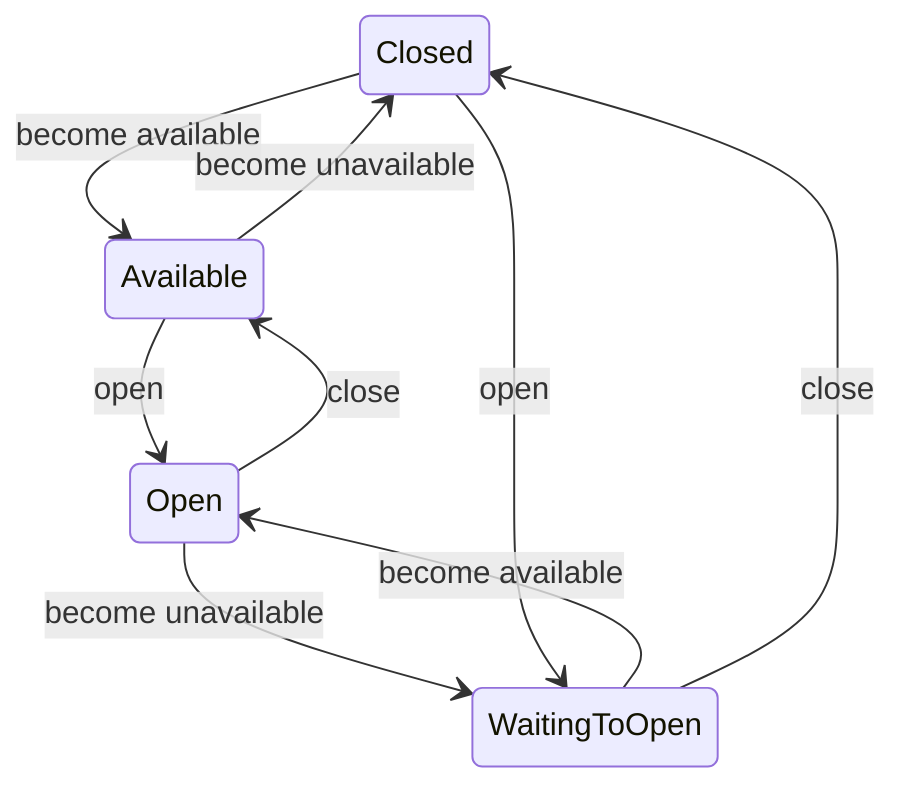

# MIDI device lifecycle: available/unavailable, open/closed, attached/detached

Three pairs of terms describe where a MIDI device stands. Each pair answers a different question, and knowing one tells
nothing about the other two:

| Pair | Question it answers | Applies to | Owned by |
| ---- | ------------------- | ---------- | -------- |
| **available** / **unavailable** | Is the device present in the system? | a MIDI device only | `MidiDeviceHandle` (`sc-midi`) |
| **open** / **closed** | Does the application hold the device reserved for I/O? | a MIDI device only | `MidiManager` (`sc-midi`) |
| **attached** / **detached** | Is a receiver wired to a transmitter, so messages flow? | a track input/output: a device **or** another track | `MidiProcessor` (`sc-midi`) |

Use exactly these words in code, ScalaDoc, log messages and docs. Never say *connect* or *disconnect*: the word reads
naturally for all three pairs, so it tells none of them apart. Likewise, never say *attached* for a device the platform
reports as present.

## Available / unavailable

**Available** means present in the system: the platform reports the device, so it can be opened. A `MidiManager`
finds out on `refresh()`, which also runs whenever the platform reports a change, and only the manager makes a handle
available or unavailable. `MidiDeviceHandle.info` is defined only while the handle is available. Unplugging a cable, a
virtual port disappearing or a device being replugged all change this pair. Events: `MidiDeviceAvailableEvent` /
`MidiDeviceUnavailableEvent`, or their `…FailedTo…` counterparts.

## Open / closed

**Open** means the application reserved the device for I/O: messages go out through `handle.receiver` and come in
through `handle.transmitter`. `MidiManager.openDevice` requests it and `closeDevice` releases it. Both are
reference-counted, so the device closes only with its last reference and releasing it for one track doesn't silence
the others. Requesting a device that isn't available doesn't fail: the handle waits for it. Events:
`MidiDeviceOpenedEvent` / `MidiDeviceClosedEvent`, or their `…FailedTo…` counterparts.

The two pairs are the axes of `MidiDeviceHandle.State`, and the device is usable only in `Open`:

A failed transition sets to false the property it concerns, as the `State` ScalaDoc details.

## Attached / detached

**Attached** means wired into the MIDI graph: a `MidiReceiver` is among the receivers of a transmitter, so messages
flow to it. This is the only pair that also applies to a track fed by another track (`FromTrackInputSpec` /
`ToTrackOutputSpec`). A track attaches its own receiver to the input device's transmitter, and the output device's
receiver to its pipeline's transmitter.

A `MidiProcessor`'s transmitter calls `onDetach` and `onAttach` with the receivers each change removes or adds.
`TunerProcessor` uses them to send the tuner's reset to each receiver that attaches, and, today, 12-EDO to each one
that detaches. A `MidiDeviceHandle`'s transmitter calls no hooks.

## How the three relate

> **What a track attaches, it requests open; what it detaches, it releases.**

Today `Track` makes both requests itself, opening in its constructor and releasing at the end of `close()`. A request
isn't its effect:

- **An open request doesn't necessarily open now.** The handle waits in `WaitingToOpen` until the device is available,
  so a track can be wired to a device not plugged in yet, and survives one being replugged with no re-attach.
- **A close request doesn't necessarily close.** It releases one reference; another track sharing the device keeps it
  open.
- **Neither makes anything available or unavailable.** Only the platform decides that pair.
- **Becoming unavailable doesn't detach.** The handle reports *closed*, then *unavailable*, while every receiver stays
  attached, ready for the device to come back.

So a track attached to a `Closed` handle, or a device closed while a track is still attached to it, is a wiring bug.
Nothing checks either today: `Track.close()` detaches from both devices before it releases them. It must detach because
a released handle whose device is still available stays live, and a later track for that device gets the same handle;
a closed track left attached would keep playing next to its replacement.

The courtesy 12-EDO messages belong to the close, not to the detach: an output that another track still holds open
must keep its tuning. Today `TunerProcessor.onDetach` sends them on every detach, which #305 fixes.

## Subject to change (#305)

[#305](https://github.com/calinburloiu/microtonalist/issues/305) keeps this vocabulary but changes what drives what:

- Attaching and detaching will make the open and close requests, instead of `Track`.
- An input detached or becoming unavailable will be released: All Notes Off to every output, then a reset of the
  `Tuner` and the `TuningChanger`.
- An output attached while open will be reset. One detached and thereby closed will also get the courtesy 12-EDO
  messages; one that another track keeps open gets neither.
- `Tuner.reset` will restate the current configuration, and the courtesy 12-EDO messages will come from a read-only
  method instead of `tune(Tuning.Standard)`.
