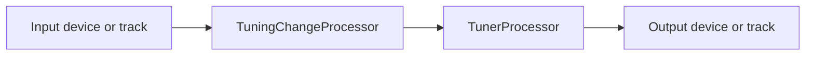
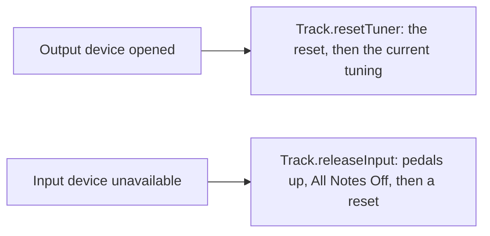

# `tuner` module architecture

## Responsibility

`tuner` is the low-level MIDI tuning engine. It turns a `Tuning` into the MIDI messages an output instrument needs to
play microtonally, and runs the per-instrument pipelines, the *tracks*, that route MIDI from an input to an output while
applying the tuning and detecting tuning-change triggers. It holds the runtime tuning and track state, behind
thread-safe services.

It doesn't decide which tunings exist: `composition` builds them and hands over a `Seq[Tuning]`. Nor does it read or
write tracks files: the `TrackRepo` trait lives here, its implementations in `format`.

## Key types

`Tuner`, `TuningChanger`, `TrackInputSpec` and `TrackOutputSpec` are plugins, which `format` (de)serializes by their
`familyName` and `typeName`.

**`Tuning`** holds 12 optional cent offsets, one per pitch class; `Tuning.Standard` is 12-EDO.

**`Tuner`** is the protocol abstraction. `reset()` configures the output instrument, `tune(tuning)` stores a tuning and
emits the messages it needs now, and `process(message)` rewrites each message of the track. The trait keeps the current
tuning: `tune` and `reset` are `final` and delegate to the `onTune` / `onReset` hooks, `reset` restating the current
tuning after the configuration. `canTune(tuning)` tells whether a tuning is within the tuner's limits, such as its
Pitch Bend Sensitivity; the tuner clamps any other tuning, with a warning, rather than throw.

| Protocol | Tuner | How it tunes | Polyphony |
| -------- | ----- | ------------ | --------- |
| MTS Octave (1-byte/2-byte, real/non-real-time) | `MtsOctave*Tuner` | An MTS SysEx retunes the instrument's pitch table in advance; notes pass through. | Polyphonic |
| Monophonic Pitch Bend | `MonophonicPitchBendTuner` | Pitch Bend, all input folded onto one output channel. | Monophonic |
| MPE | `MpeTuner` | Pitch Bend per note, on the MPE Member Channel it allocates to the note. | Polyphonic |

`MpeTuner` routes each message by its channel's role in the MPE Zones and allocates notes to Member Channels; see
[`mpe-tuner.md`](mpe-tuner.md).

**Tuning-change detection.** A `TuningChanger` inspects each message and returns a `TuningChange`: effective (previous,
next or by index) or ineffective. `PedalTuningChanger` triggers on a pedal-like Control Change crossing a threshold.

**Processors.** `TuningChangeProcessor` asks its tuning changers in order, the first effective decision winning, and
calls `TuningService.changeTuning`. `TunerProcessor` wraps a `Tuner`: it sends the tuner's reset to every receiver
attached to its transmitter and restores 12-EDO on every receiver detached from it.

**Tracks.** A `Track` is one instrument pipeline built from a `TrackSpec`, whose `TrackInputSpec` and
`TrackOutputSpec` each name a device or another track. `TrackManager` builds and replaces the tracks, wires the links
between them, and reacts to tuning and device events.

**Sessions and services.** `TuningSession` holds the tunings and the current index; `TrackSession` loads and edits the
tracks. Both run on the business thread and publish events, behind the thread-safe `TuningService` and `TrackService`.
`TunerModule` wires them around the `MidiManager` that `app` gives it.

## Track pipeline

Either processor is optional. The output device's receiver is attached when the track is built, so the tuner's reset
reaches it at once; `TrackManager` attaches the downstream tracks afterwards. A device spec's channel filters the input
or remaps the output.

## Tuning-change flow

Loading a composition sets the session's tunings, and their `TuningsUpdatedEvent` makes `TrackManager` retune every
track the same way.

## Device changes

- Only the tracks wired straight to the device react.
- A device available when its track is built needs no event: attaching it already sends the reset.
- `TrackManager` forgets the old tracks before building new ones, so that an event never reaches a closed track.

## Threading

The sessions, `TrackManager`, the tuners, the tuning changers and their processors are `@NotThreadSafe` and run on the
business thread (see [`businessync`](../businessync/README.md)); other threads go through the services. The exception
is `TrackManager`'s `MidiEvent` handler, which runs on the thread publishing the event.

## Subject to change

- `Track` doesn't run on a thread of its own yet (#121).
- Events are subscribed to with Guava's `@Subscribe`, and device events are handled on the publishing thread (#90).
- `TuningService.tunings` is deprecated until the UI moves to JavaFX (#99).
- A link declared from both of its ends is wired twice (#296).
- A track fed by another track loses the messages that arrive before the link is wired (#298).
- The courtesy 12-EDO messages make 12-EDO the tuner's current tuning, and attaching and detaching will drive the
  device requests (#305; see [`midi-device-lifecycle.md`](../midi-device-lifecycle.md#subject-to-change-305)).
- A track fed by another track isn't released or reset when the feeding track's input device goes away (#316).
- A tuning beyond a tuner's limits is only warned about when applied (#326).
