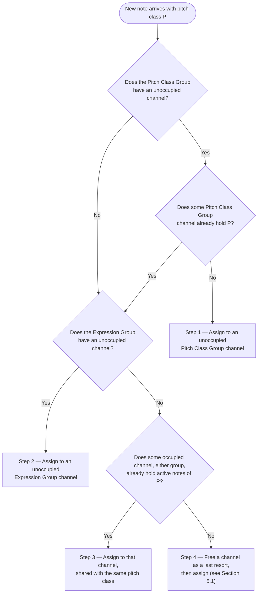

# Draft: MPE Tuner Allocation Algorithm Diagram

> Draft companion to Section 4.5 ("Allocation Algorithm") of [`mpe-tuner-paper.md`](mpe-tuner-paper.md). Not yet
> integrated into the paper — pending discussion.

This diagram visualizes the four-step channel-selection procedure of Section 4.5: when a new note arrives, the MPE Tuner
walks the steps in order and stops at the first one that applies.

**Scope.** The diagram is deliberately limited to Section 4.5's step structure:

- The **tie-breaking** criteria (a)–(e) are omitted. They cut across the steps — choosing among multiple valid
  candidate channels at any step — rather than forming steps of their own, and remain documented as prose in Section
  4.5. Whenever a step admits more than one candidate channel, those criteria pick the one used.
- The broader end-to-end flow (the Master-Channel forwarding gate of §3.4, the high-expressive-bend rules of §5.2, and
  the output message ordering) is out of scope here; it is covered by Appendix B's full decision flowchart.

Each compound `AND`/`OR` condition is broken into its own decision node rather than packed into a single box: Step 1's
`unoccupied PCG channel` **AND** `no PCG channel holds P` becomes the two nodes `Q1a` and `Q1b`, and routing both of
their failing branches to Step 2 dissolves the `OR` ("P already in the PCG **or** the PCG is full") that would otherwise
hide inside a single node's negative edge.

