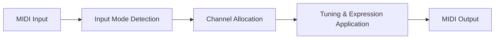
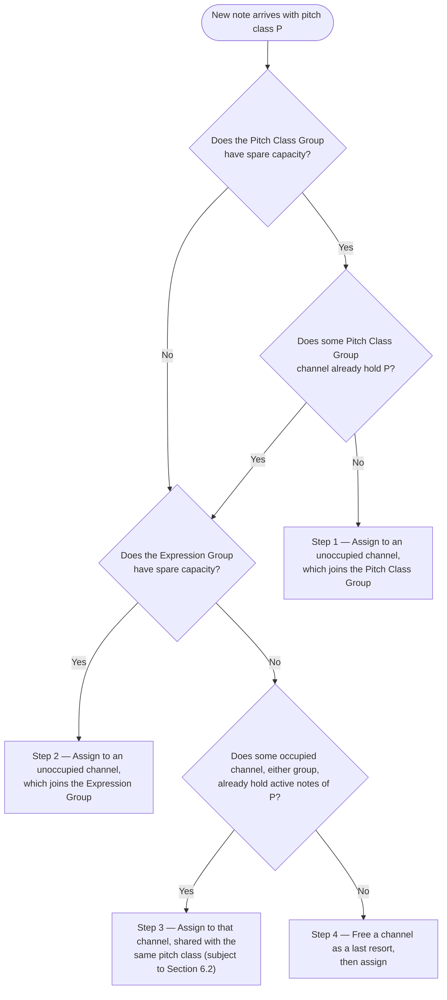

# MPE Tuner: A MIDI Polyphonic Expression Approach to Microtonal Intonation

Călin-Andrei Burloiu, 2026

[Microtonalist](https://github.com/calinburloiu/microtonalist)

**Abstract.**
This paper presents the MPE Tuner, a MIDI signal processing component of the [Microtonalist](https://github.com/calinburloiu/microtonalist) application that applies microtonal tunings to polyphonic MIDI streams by leveraging the MIDI Polyphonic Expression (MPE) protocol. A core capability of the MPE Tuner is support for real-time tuning changes during performance, enabling the use of complex tuning systems in which twelve pitch classes per octave are insufficient and the performer must switch between tunings to access additional pitches. The MPE Specification (RP-053, v1.0, 2018) defines a mechanism for per-note pitch and articulation control by assigning notes to individual MIDI Channels within configurable Zones. The MPE Tuner exploits this mechanism to apply pitch-class-based tuning offsets via per-channel Pitch Bend messages. However, standard MPE channel allocation strategies are insufficient when intonation precision is a primary design goal. This paper details the MPE Tuner's architecture, its channel allocation strategy employing a novel dual-group partitioning of Member Channels, its handling of non-MPE to MPE conversion, its model of polyphonic expression based on per-note Expression Values, and the deliberate departures from the MPE Specification's recommendations that are necessary to guarantee correct and stable microtonal intonation under polyphonic conditions. This paper is intended to serve as a reference for software implementations.

---

## 1. Introduction

### 1.1 Motivation

The MIDI 1.0 protocol [2] encodes pitch as discrete note numbers — Middle C carrying the reference value 60 [2, p. 10] — conventionally interpreted in the twelve-tone equal temperament tuning system (12 equal divisions of the octave, 12-EDO); the specification's own MIDI Tuning extension confirms this default interpretation by defining microtunings as "user-defined scales other than 12-tone equal temperament" [2, p. 47]. Musicians and composers working with microtonal tuning systems, historical temperaments, or non-Western scales require a mechanism to deviate from 12-EDO while retaining the polyphonic expressiveness that modern MIDI controllers and instruments afford.

Many tuning systems of musical interest employ more than twelve distinct pitches per octave. Maqam music, for example, uses quarter-tone inflections that double the number of available pitch classes; just intonation systems may require dozens of distinct pitches to cover all harmonic relationships across multiple keys. When a tuning system exceeds twelve pitches per octave, the twelve keys per octave of a standard MIDI keyboard are insufficient to address all pitches simultaneously. A performer working in such a system must be able to switch between tunings in real time — reassigning the twelve keys to different subsets of the tuning system's pitch inventory as the musical context demands. Real-time tuning change is therefore not an auxiliary feature but a core capability that the MPE Tuner is designed to support.

Several approaches to microtonality over MIDI exist. The MIDI Tuning Standard (MTS) uses System Exclusive messages to reprogram an instrument's pitch table [2, pp. 47–51]. Monophonic Pitch Bend tuners apply per-note pitch correction on a single-voice basis. MIDI 1.0 also defines a channel-wide Master Tuning facility through RPN 00 01 (fine tuning, in fractions of a cent) and RPN 00 02 (coarse tuning, in semitone steps) [2, p. 18]; it transposes an entire channel uniformly and therefore cannot express per-pitch-class offsets. Each approach is limited to instruments that support the respective protocol. The MPE Tuner presented in this paper targets the increasingly prevalent class of instruments that support MIDI Polyphonic Expression (MPE), as specified in the MIDI Manufacturers Association's RP-053 [1].

MPE achieves per-note control by assigning each sounding note to its own MIDI Channel within a defined Zone (Section 2.1), thereby enabling independent Pitch Bend, Channel Pressure, and CC #74 (timbre or slide) control for each note. This per-note Pitch Bend capability provides a natural substrate for applying microtonal tuning offsets: the tuning correction for each note can be expressed as a Pitch Bend value on that note's dedicated Member Channel.

### 1.2 Scope and Definitions

A **Tuning**, in the context of this paper, is a set of twelve pitch offsets — one for each pitch class (C, C♯, D, ..., B) — measured relative to the standard 12-EDO tuning. A Tuning may be changed by the performer in real time.

A **Tuner** is a MIDI processing device that applies a given Tuning to a MIDI signal using a specific output protocol. It receives MIDI input assumed to be in standard 12-EDO tuning, processes the messages according to the active Tuning, and produces MIDI output conforming to a protocol understood by the receiving instrument. The Tuner has a single MIDI input and a single MIDI output. Examples of Tuner types include:

- **MTS Tuner**: outputs MIDI Tuning Standard SysEx messages for instruments supporting MTS.
- **Monophonic Pitch Bend Tuner**: outputs Pitch Bend on a single channel for monophonic instruments.
- **MPE Tuner**: outputs MPE-conformant messages for instruments supporting MPE.

### 1.3 Control Dimensions

MPE provides three **control dimensions** through which each note may be shaped independently of the others: Pitch Bend, Channel Pressure, and CC #74 [1, §2.4–2.6]. Because every note is assigned its own Member Channel, these otherwise channel-wide messages act as per-note controls.

The MPE Tuner decomposes the Pitch Bend of an output Member Channel into two components:

- **Tuning Pitch Bend**: the component that realizes the tuning offset for the pitch class associated with the output Member Channel. It is computed by the Tuner from the active Tuning and is not directly controlled by the performer.
- **Expression Pitch Bend**: the component controlled by the performer in real time for expressive purposes — vibrato, glissandi, and other transient deviations from the tuned pitch.

The Pitch Bend emitted on an output Member Channel is always the sum of the two components:

> **Pitch Bend = Tuning Pitch Bend + Expression Pitch Bend**

Any pitch alteration present in the input signal is never interpreted as an alternative tuning; it contributes exclusively to the expression domain — as Expression Pitch Bend in MPE Input Mode, or as Master Channel Pitch Bend in Non-MPE Input Mode (Section 3.3) — while the Tuning Pitch Bend is derived solely from the active Tuning.

The performer-controlled values of the three control dimensions are collectively called **Expression Values**. A note's Expression Values comprise its Expression Pitch Bend, its Channel Pressure, and its CC #74 value. The Tuning Pitch Bend is not an Expression Value: it belongs to the tuning domain, not to the expression domain. Section 7 specifies how the Expression Values of individual notes are combined on output Member Channels.

### 1.4 Overview of Operation

The MPE Tuner sits in the MIDI signal path between a controller (or sequencer) and an MPE-capable instrument. It performs the following operations:

1. Receives MIDI input, which may be either conventional (non-MPE) or MPE.
2. Allocates incoming notes to MPE Member Channels according to a strategy that prioritizes intonation precision.
3. Computes the appropriate Pitch Bend value for each Member Channel as the sum of the Tuning Pitch Bend for the channel's pitch class and the Expression Pitch Bend derived from the input (Section 1.3); in Non-MPE Input Mode the Expression component is absent (Section 3.3).
4. Outputs a fully MPE-conformant MIDI stream.

The output of the MPE Tuner is always MPE, regardless of whether the input is MPE or non-MPE. The input mode may be configured through a non-MIDI interface or detected automatically: upon receiving an MPE Configuration Message (MCM), the MPE Tuner shall switch to MPE Input Mode and reconfigure its Zones accordingly (Section 4).

The obligations of output conformance to the MPE Specification are specified where they arise: configuration of Zones and Pitch Bend Sensitivity in Section 4, Note On message ordering in Section 7.1.1, Master Channel forwarding in Section 3.4, Note Off behavior in Section 7.1, and the Channel Pressure reset at Note Off in Section 7.4.

---

## 2. Background: The MPE Specification

This section summarizes the relevant aspects of the MPE Specification (RP-053, v1.0) [1] that form the foundation upon which the MPE Tuner operates. Readers familiar with the MPE Specification may proceed to Section 3.

MPE is a recommended practice layered entirely on MIDI 1.0 [2]: every construct it defines is expressed with standard Channel Voice and Channel Mode messages, so an MPE stream is also a valid MIDI 1.0 stream. Four facts of the MIDI 1.0 Specification recur throughout this paper.

First, the Pitch Bend Change message carries 14-bit resolution and — unlike other continuous controls, whose LSB may be omitted — is always transmitted with both data bytes; the center value 2000H (MSB 40H, LSB 00H) denotes no pitch deviation [2, p. 19]. Throughout this paper, Pitch Bend values are expressed as signed offsets from this center, so a Pitch Bend of 0 denotes the centered, no-deviation state. The pitch deviation that a given value produces is determined by the receiver's Pitch Bend Sensitivity, set through Registered Parameter Number (RPN) 00 00, whose Data Entry MSB expresses the sensitivity in semitones and whose LSB expresses it in cents [2, pp. 17–19]. An RPN is not a message of its own but a MIDI 1.0 procedure: the sender selects the parameter with CC #101 (RPN MSB) and CC #100 (RPN LSB), then applies a value with Data Entry (CC #6 for the MSB, CC #38 for the LSB) [2, p. 17]; the MPE Configuration Message of Section 2.1 follows the same procedure.

Second, MIDI 1.0 provides two forms of aftertouch: Polyphonic Key Pressure, addressed to an individual note number, and Channel Pressure, which affects all notes sounding on the channel [2, p. 19]. MPE builds its per-note pressure dimension on Channel Pressure — made per-note by channel isolation — while restricting Polyphonic Key Pressure as described in Section 2.7.

Third, CC #74 is defined by MIDI 1.0 as Sound Controller 5, with Brightness as its default assignment [2, pp. 14–15]; MPE repurposes it as the third per-note control dimension, conventionally controlling timbre [1, §3.3.5].

Fourth, MIDI 1.0 combines two receiver switches — Omni On/Off, which selects whether voice messages are recognized on all channels or only on channels the receiver is assigned to, and Mono/Poly, which selects one voice per channel or full polyphony — into four channel modes, set by the Channel Mode messages CC #124–127 on the receiver's Basic Channel [2, pp. 6–8, 20–23]. Omni On/Poly (Mode 1) is the recommended power-up default [2, p. 8]. MPE is designed for Mode 3 (Omni Off/Poly) operation, although it can also serve Mode 4 (Omni Off/Mono) receivers with restrictions [1, §2.2.1–2.2.2]; Section 3.5 specifies the modes at which the MPE Tuner operates.

### 2.1 Zones, Master Channels, and Member Channels

MPE organizes the sixteen MIDI Channels [2, p. 3] into one or two **Zones**. Each Zone consists of a **Master Channel** and one or more **Member Channels**:

- The **Lower Zone** uses Channel 1 as its Master Channel, with Member Channels allocated sequentially upward from Channel 2.
- The **Upper Zone** uses Channel 16 as its Master Channel, with Member Channels allocated sequentially downward from Channel 15.

A Zone is configured by sending an MCM — Registered Parameter Number (RPN) 00 06 — on the Master Channel of the desired Zone. The Data Entry MSB (CC #6) specifies the number of Member Channels. When only one Zone is active, the Master Channel of the unused Zone is available as a Member Channel, permitting up to 15 Member Channels.

A MIDI Channel cannot be assigned to more than one Zone: when an MCM configures a Zone to include channels previously assigned to the other Zone, the most recent message takes precedence, and sending an MCM with zero Member Channels deactivates the addressed Zone [1, §2.1.1]. When a Zone configuration changes, receivers are required to stop all ongoing notes and to reset all controls to reasonable default values on each channel entering or leaving MPE control [1, §2.1.4].

### 2.2 Per-Note Control via Channel Assignment

The MPE Specification states:

> "An MPE controller assigns every new note its own MIDI Channel, until there are no unoccupied Channels available." [1, §2.2.1]

Each note assigned to its own Member Channel can receive independent Pitch Bend, Channel Pressure, and CC #74 messages. Messages sent on the Master Channel apply to all notes in the Zone. The specification requires that if a device receives Pitch Bend (or Channel Pressure, or CC #74) on both a Master and a Member Channel, "it must combine the data meaningfully" [1, §2.3.2].

### 2.3 Pitch Bend Sensitivity

Upon receiving an MCM, a receiver must set:

- **Master Channel Pitch Bend Sensitivity**: ±2 semitones (default).
- **Member Channel Pitch Bend Sensitivity**: ±48 semitones (default).

These values may be changed via RPN 00 00 [2, pp. 17–18]. All Member Channels within a Zone must share the same Pitch Bend Sensitivity value [1, §2.4].

### 2.4 Channel Allocation Recommendations

The MPE Specification provides guidelines for allocating notes to Member Channels when implementing an MPE controller:

> "In the simplest workable implementation, a new note will be assigned to the Channel with the lowest count of active notes. Then, all else being equal, the Channel with the oldest last Note Off would be preferred." [1, §3.2]

The specification acknowledges that multiple notes may need to coexist on the same Channel when all Channels are occupied, and that there are legitimate scenarios for having the same Note Number active on two different Channels:

> "However, in particular circumstances it is appropriate to have the same Note Number active on two different MIDI Channels. For example, a note may start at a certain pitch and be bent to another before a second note is initiated at the original pitch. Alternatively, a guitar-type controller might permit the same pitch to be played simultaneously on different strings." [1, §3.2]

When all Channels are occupied, the specification suggests two approaches:

> "A controller may choose the Channel in which the change of pitch for the new note requires the smallest adjustment of pitch for other playing notes. Alternatively, at least one commercial implementation provides gentle degradation of pitch control when all Channels are occupied by switching to a mode where notes step discretely from one pitch to the next, permitting Pitch Bend to respond only to small vibrato gestures." [1, §3.2]

Allocation concerns Member Channels, but notes are not confined to them: "For the sake of MIDI 1.0 compatibility, Note On/Off messages are permitted on the Master Channel, and a synthesizer must respond to these" [1, §3.2]. Such notes forgo the per-note control dimensions, since the Master Channel's control messages affect the whole Zone.

### 2.5 Note On Setup and Message Ordering

The specification recommends sending all control dimension messages (Pitch Bend, CC #74, Channel Pressure) before the Note On message to prevent audible artifacts:

> "Provided that the Note On follows all necessary initial settings for pitch and articulation, other orderings of these messages will work equally well." [1, §3.3.1]

This practice prevents "swooping" noises, which arise when a stale control value retained on a Channel — most commonly a previous note's Pitch Bend — is corrected only after a new note has begun sounding.

The initial state that these setup messages establish is complemented by a receiver-side obligation: control values "must be tracked and stored on all Member Channels, even when no note is playing, to provide an initial state for a new note" [1, §3.3].

### 2.6 Zone-Level Messages

MPE distinguishes note-level messages, which shape an individual note through its Member Channel, from Zone-level messages, which affect all notes in a Zone. Zone-level messages such as the Damper Pedal "should be sent only on a Zone's Master Channel (not on Member Channels). If an MPE synthesizer receives one of those messages on a Member Channel, it must ignore it" [1, §2.3]. Table 1 of the specification classifies every MIDI message along these lines.

### 2.7 Pressure

Pressure is subject to dedicated rules: "Polyphonic Key Pressure must not be sent on Member Channels" [1, §2.5] — per-note pressure is conveyed there by Channel Pressure instead — while on the Master Channel, "Polyphonic Key Pressure may be sent for notes on the Master Channel at the discretion of the implementer, to preserve compatibility with non-MPE-aware devices" [1, §2.5].

---

## 3. MPE Tuner Architecture

### 3.1 Signal Flow

The MPE Tuner is a stateful MIDI processor with the following signal flow:



1. **Input Mode Detection**: Determines whether the incoming stream is MPE or non-MPE. The mode may be set via a non-MIDI configuration interface. Receipt of an MCM shall cause the Tuner to switch to MPE Input Mode automatically and to reconfigure its Zones according to the message (Section 4).

2. **Channel Allocation**: Assigns each incoming note that arrives on a Member Channel (in MPE Input Mode) or on any
   channel (in Non-MPE Input Mode) to a Member Channel in the output Zone(s), following the dual-group allocation
   strategy described in Section 5. This allocation enforces the **pitch-class invariant** (Section 5.1): all notes
   simultaneously active on a Member Channel share the same pitch class, so each occupied channel is associated with
   exactly one pitch class — and therefore one tuning offset. Notes received on a Master Channel in MPE Input Mode are
   exempt from allocation and are forwarded as-is (see Section 3.4).

3. **Tuning & Expression Application**: For each occupied Member Channel, computes the output Pitch Bend as the sum of
   the Tuning Pitch Bend for the channel's associated pitch class and the channel's Expression Pitch Bend — the average
   of the Expression Pitch Bends of its active notes (Section 7). The Expression Pitch Bend component applies in MPE
   Input Mode; in Non-MPE Input Mode the input's Pitch Bend is redirected to the Master Channel
   (Section 3.3), so the Member Channel Pitch Bend encodes the Tuning Pitch Bend alone. The Channel Pressure and CC #74
   Expression Values of each channel are maintained under the same aggregation model (Section 7).

### 3.2 Input Modes

The MPE Tuner accepts two classes of input:

- **Non-MPE input**: Conventional MIDI where all notes may arrive on a single channel or across channels without MPE Zone structure. This input requires conversion to MPE (Section 3.3) and is routed to a single output Zone (Section 4.2). In this mode the Zone configuration originates solely from the non-MIDI configuration interface (Section 4.2). In MIDI 1.0 receiver terms, the Tuner accepts this input as an Omni-On/Poly (Mode 1) device: notes are recognized on all sixteen channels and merged into a single polyphonic stream (Section 3.5). Transmitters that assign meaning to channel numbers — notably Mode 4 guitar-type controllers with one string per channel — are accepted, but the merge collapses their per-channel controls onto a single stream (Section 3.3, item 2).
- **MPE input**: MIDI conforming to the MPE Specification, with notes primarily distributed across Member Channels
  within Zones, and optionally on Master Channels as permitted by the specification (see Section 3.4). The input stream
  may contain MPE Configuration Messages, which reconfigure the Tuner's Zones (Section 4.2).

In both cases, the output is always MPE-conformant.

### 3.3 Non-MPE to MPE Conversion

When the input is non-MPE, the MPE Tuner must perform the following conversions to produce valid MPE output:

1. **Polyphonic Key Pressure to Channel Pressure**: In MPE, Polyphonic Key Pressure must not be sent on Member Channels
   [1, §2.5]. Any Polyphonic Key Pressure message in the non-MPE input is converted to a Channel Pressure message —
   MIDI 1.0's channel-wide form of aftertouch [2, p. 19] — on the Member Channel hosting the addressed note; when
   multiple notes share that channel, the converted values are combined by averaging (Section 7.3). A Polyphonic Key Pressure addressed to a note number that is not currently
   active has no Member Channel to target and is discarded; the Tuner does not retain it to influence a later Note On.

2. **Channel-Global Control Redirection to Master Channel**: In non-MPE input, Pitch Bend, CC #74, and Channel Pressure
   are ordinary Channel Voice messages, so each applies to all notes on the input channel rather than to an individual
   note [2, p. 19]. These channel-global controls shall be redirected to the Master Channel of the single output Zone
   selected for non-MPE input (see Section 4.2), where
   they serve as Zone-level controls affecting all notes equally. Consequently, none of these three dimensions carries
   a per-note value onto a Member Channel. When the input spans multiple channels, the redirected controls of all input
   channels merge onto the single Master Channel, the most recent message taking effect: the Tuner treats non-MPE input
   as one merged control stream rather than preserving per-input-channel independence.

3. **Control Dimension Initialization**: To maximize compatibility with MPE receivers and to prevent audible artifacts
   at note onset [1, §3.3.1], the control dimensions of the assigned Member Channel shall be brought to their correct
   values before each Note On message; messages may be omitted for dimensions whose values are already correct on that
   channel (Section 7.1). Because item 2 routes the input's channel-global Pitch Bend, CC #74, and Channel Pressure to
   the Master Channel, none of these dimensions is taken from the input onto the Member Channel; each is therefore
   determined as follows:
    - **Pitch Bend**: the Tuning Pitch Bend for the note's pitch class. There is no per-channel Expression Pitch Bend
      in Non-MPE Input Mode — the input's Pitch Bend lives on the Master Channel (item 2) — so the Member
      Channel Pitch Bend encodes the Tuning Pitch Bend alone.
    - **Channel Pressure**: 0 [1, §3.3.4]. A non-zero value can arise later in the note's lifetime as the Tuner converts
      incoming Polyphonic Key Pressure for the active note (item 1), but at onset the value is always the default:
      Polyphonic Key Pressure that precedes a note's Note On is discarded rather than retained (item 1), and such
      ordering is in any case uncommon and of questionable musical meaning, since Polyphonic Key Pressure models
      pressure on a key that is already held.
    - **CC #74**: not emitted on Member Channels. In Non-MPE Input Mode there is no source of per-note CC #74 — the
      dimension is controllable only globally, via the Master Channel (item 2) — so the Tuner never sends CC #74 on a
      Member Channel (Section 7.3).

4. **Redirection of Remaining Channel Messages**: All other Channel Voice and Channel Mode messages received on a
   non-MPE input channel — for example Damper Pedal (CC #64), Modulation (CC #1), Channel Volume (CC #7), Program Change
   and Bank Select [2, Table III], and Reset All Controllers (Channel Mode message 121 [2, p. 25]) — are redirected to
   the Master Channel of the selected output Zone, where they act as Zone-level messages (Section 3.4). Non-MPE input has no Master Channel of its own from which
   Section 3.4's forwarding could operate; this redirection gives those messages their conformant Zone-level home on
   the output. A Pitch Bend Sensitivity message (RPN 00 00) received on the non-MPE input is likewise forwarded to the
   Master Channel, where it configures the sensitivity of the Master Channel Pitch Bend to which the input's Pitch Bend
   is redirected (Section 4.3). Two refinements apply to the Channel Mode messages. All Sound Off (120) and
   All Notes Off (123) are redirected like the rest, and the Tuner does not clear its own note-tracking state upon
   receiving them (Section 3.5). The MIDI Mode messages (CC #124–127) are the sole exception to redirection: they are
   discarded under the fixed-mode policy of Section 3.5.

### 3.4 Master Channel Forwarding

The MPE Specification permits Note On and Note Off messages on a Master Channel, and requires receivers to respond to
them [1, §3.2]. Placing a note on the Master Channel is a deliberate choice by the MPE sender: the sender opts out of the
three dimensions of per-note expressive control delivered by Pitch Bend, Channel Pressure, and CC #74, accepting that
any of these messages applied to the Master Channel will affect every sounding note in the Zone. In exchange, the sender
may gain a form of per-note pressure that is available only on the Master Channel: Polyphonic Key Pressure. The MPE
Specification [1, §2.5] forbids Polyphonic Key Pressure on Member Channels but permits it on Master Channel notes at the
implementer's discretion, for compatibility with non-MPE-aware devices; a performer playing a Master Channel note
therefore retains per-note pressure where the sending and receiving implementations recognize Polyphonic Key Pressure on
the Master Channel, in place of the Channel Pressure dimension that Member Channel notes use.

In MPE Input Mode, the MPE Tuner shall honor this sender intent: Note On and Note Off messages received on a Master
Channel of an enabled Zone are forwarded on the same Master Channel without modification, bypassing the channel
allocation procedure described in Section 5. The MPE Tuner shall not emit any Pitch Bend, CC #74, or Channel Pressure
setup messages for a Master Channel Note On.

A direct consequence of this behavior is that **notes forwarded on the Master Channel do not receive a per-pitch-class
tuning offset**. They sound in 12-EDO, modulated only by the Master Channel Pitch Bend that the performer sends for
expressive purposes (see Section 5.7.5). This is an unavoidable consequence of the pitch-class invariant (Section 5.1):
the Master Channel's Pitch Bend is a Zone-level message that affects all Member Channel notes, so it cannot be used to
encode a tuning offset for a specific pitch class without mistuning every other sounding note.

The rationale for preserving sender intent rather than silently reallocating Master Channel notes to Member Channels is
threefold:

1. **Compliance with the MPE Specification.** The specification explicitly permits Master Channel notes and requires
   that receivers play them [1, §3.2]. Silently relocating them would violate the sender's explicit channel assignment.
2. **Conservation of Member Channel resources.** Master Channel notes are, by design, notes that do not require per-note
   control. Placing them on a Member Channel would consume a slot unnecessarily, reducing the Zone's effective polyphony
   for notes that do require per-note control.
3. **Preservation of Polyphonic Key Pressure compatibility.** The MPE Specification [1, §2.5] forbids Polyphonic Key
   Pressure on Member Channels but allows it on Master Channel notes. Forwarding Master Channel notes as-is preserves
   the ability to use Polyphonic Key Pressure on those notes.

The forwarding rule extends beyond notes. The MPE Tuner forwards Master Channel Pitch Bend as received, without
modification; Master Pitch Bend is a Zone-level expressive control, and Section 5.7.5 discusses its relationship to
tuning. Zone-level messages — Damper Pedal, Program Change, Reset All Controllers, and the other messages listed in
Table 1 of the MPE Specification (Section 2.6) — are likewise forwarded on the Master Channel without modification.
The MPE Tuner does not interpret or alter any of these messages. The MIDI Mode messages (CC #124–127) are an
exception: they are not Zone-level messages [1, Table 1] and are discarded under the fixed-mode policy of Section 3.5.

In Non-MPE Input Mode there is no input Master Channel to forward from: every incoming note is allocated to a Member
Channel regardless of the input channel number, and the input's channel-global controls and Zone-level messages reach
the output Master Channel by *redirection* instead, under the conversion rules of Section 3.3, items 2 and 4.

### 3.5 MIDI Channel Modes

MIDI 1.0 defines four channel modes from the Omni and Mono/Poly receiver switches (Section 2). The MPE Tuner is
**fixed-mode by design**, on both its input and its output.

On the input side, Non-MPE Input Mode operates as MIDI 1.0's Omni-On/Poly receiver (Mode 1): voice messages are
recognized on all sixteen channels and merged into one polyphonic stream (Sections 3.2 and 3.3). The choice mirrors
MIDI 1.0's recommended power-up default [2, p. 8] and suits a processor that defines no Basic Channel of its own — the
configuration model of Section 4 contains no input-channel filter of the kind Omni Off would require. Mono operation is
likewise never applied to input: the Tuner imposes no one-voice-per-channel limit and no legato retriggering.

On the output side, the Tuner requires MIDI Mode 3 (Omni Off/Poly) — the mode for which MPE is designed [1, §2.2.1] —
and the requirement is structural rather than preferential. The channel economy of the pitch-class invariant rests on
channel sharing: multiple notes of one pitch class coexisting on one Member Channel (Section 5.1). A channel operating
in Mode 4 is monophonic — starting a note stops the note already playing [1, §2.2.2] — so Mode 4 would turn every
shared allocation into an unintended note drop.

The Tuner therefore neither emits MIDI Mode messages nor forwards received ones: CC #124–127 are discarded in both
input modes. Discarding the Omni messages (CC #124 and #125) is uncontroversial — the MPE Specification states they
should not be sent and will be ignored [1, Table 1] — but discarding Mono On and Poly On (CC #126 and #127) is a
deliberate departure from transparent forwarding: an MPE-compatible synthesizer that supports both modes must switch
to Mode 4 upon receiving CC #126 on its Basic Channel [1, §2.2.2], which would break the channel-sharing premise
downstream while the Tuner's allocation state continues to assume polyphonic channels. Section 5.7.6 records this
departure.

The remaining Channel Mode messages — All Sound Off (120), Reset All Controllers (121), Local Control (122), and
All Notes Off (123) — pass through the Tuner as Zone-level messages, forwarded (Section 3.4) or redirected
(Section 3.3, item 4) on the output Master Channel. Receiving All Sound Off or All Notes Off does not clear the
Tuner's note-tracking state: MIDI 1.0 requires that every Note On still be terminated by its own Note Off and forbids
All Notes Off as a substitute [2, pp. 24–25], so the Tuner's state reconciles through the ordinary Note Off path while
the downstream Zone responds to the message itself. MIDI 1.0 in fact directs receivers to ignore All Notes Off while
Omni is on [2, p. 25]; the Tuner, although Omni-On-like on input, is a processor rather than a sound generator, so
instead of consuming the message it delivers it to the output Zone, whose response is governed by the MPE
Specification.

---

## 4. Configuration

The MPE Tuner's operation is governed by three configuration parameters, established before any note flows and applying across every stage of the pipeline: the input mode (Section 4.1), the Zone configuration (Section 4.2), and the Pitch Bend Sensitivity (Section 4.3). All three follow the same model: the parameter is established through a **non-MIDI configuration interface**, and may additionally be overridden in-band, through MIDI messages received on the input — MCMs for the input mode and the Zones, and Pitch Bend Sensitivity messages (RPN 00 00) for the Pitch Bend Sensitivity — subject to the per-parameter limitations stated in the subsections below. Where the MPE Specification defines defaults, notably the Pitch Bend Sensitivity values of Section 2.3, the Tuner adopts them in the absence of explicit configuration.

### 4.1 Input Mode

Section 3.2 defines the two input modes; this subsection specifies how the operating mode is selected. The input mode may be set through the non-MIDI configuration interface, or switched in-band by the input stream itself (Section 3.1): upon receiving a valid MCM, the Tuner switches to MPE Input Mode if it is not already in it. The in-band switch is one-way: no MCM returns the Tuner to Non-MPE Input Mode, which is re-entered only through the non-MIDI configuration interface.

MCMs that deactivate all Zones are no exception: they too switch the Tuner to MPE Input Mode if necessary, and they turn MPE operation off [1, §2.1]. The Zone configuration is shared by the input and the output (Section 4.2), so all Zones being deactivated leaves the output without MPE as well; the deactivation is mirrored on the output like any other Zone change (Section 4.2), and the Tuner produces no note output until a Zone is re-activated, by a subsequent MCM or through the non-MIDI configuration interface.

### 4.2 Zones

The MPE Tuner maintains a single Zone configuration shared by its input and its output — not separate input and output configurations: the number of Member Channels allocated to the Lower Zone and, optionally, to the Upper Zone. As in the MPE Specification, one or two Zones may be defined. The role this shared configuration plays depends on the input mode:

- In **MPE Input Mode**, the Zone configuration applies to both input and output: the Tuner expects the input stream to be organized according to the configured Zones, and produces output organized by the same Zones. Notes received on the Member Channels of an input Zone are allocated to Member Channels of the same output Zone.
- In **Non-MPE Input Mode**, the input has no Zone structure, so the Zone configuration affects the output only. Furthermore, only one Zone is accessible from the output: input notes are routed exclusively to the Lower Zone if it is enabled, otherwise to the Upper Zone. When two Zones are defined, the Upper Zone is ignored. This restriction prevents ambiguity in channel allocation and zone-level message routing when the input carries no Zone information of its own.

Beyond the non-MIDI configuration interface, the Zone configuration may be changed in-band, through an MCM received on a Master Channel. Conforming to the MPE Specification, an MCM received on any channel other than a Master Channel is invalid and is ignored [1, §2.1.1]. A valid MCM — which also switches the Tuner to MPE Input Mode if it is not already in it (Section 4.1) — reconfigures the addressed Zone to the received number of Member Channels, applying the specification's rules: an MCM with zero Member Channels deactivates the Zone, and channels claimed from the other Zone are reassigned to the Zone configured most recently [1, §2.1.1]. An MCM that deactivates all Zones suspends MPE operation altogether (Section 4.1).

The Tuner emits the MCM(s) describing its Zone configuration at start-up, and again whenever the configuration changes — through either mechanism — so that the receiving instrument adopts the same Zone structure. A reconfiguration also resets the Tuner's state for every channel entering or leaving MPE control, mirroring the receiver obligations of the MPE Specification [1, §2.1.4]: active notes on the affected channels are dropped, the channels' group assignments (Section 5.2) are cleared, the retained Expression Values and remembered input-channel control values (Section 7) return to their defaults — Expression Pitch Bend 0, Channel Pressure 0, and CC #74 64, the centered initial value the MPE Specification prescribes for a bipolar third dimension [1, §3.3.5] — and Pitch Bend Sensitivity returns to the specification's defaults of ±48 semitones on Member Channels and ±2 semitones on the Master Channel (Section 4.3). Channels of a Zone untouched by the reconfiguration keep their notes and state. For the dropped notes, an implementation may either emit no Note Off messages — relying on the downstream receiver's obligation to stop ongoing notes upon receiving the MCM [1, §2.1.4] — or emit explicit Note Off messages before the MCM, for robustness with receivers that do not fully conform; the choice is left to the implementer.

### 4.3 Pitch Bend Sensitivity

The MPE Specification defines default Pitch Bend Sensitivity values — ±48 semitones for Member Channels and ±2 semitones for the Master Channel — and makes the MCM the trigger that applies them: upon receiving an MCM, a receiver must reset the Pitch Bend Sensitivity of the affected channels to these defaults (Section 2.3) [1, §2.4]. The MPE Tuner relies on these defaults both when interpreting incoming Pitch Bend and when encoding Pitch Bend on its output.

The Tuner also listens for Pitch Bend Sensitivity messages (RPN 00 00) on its input and conforms to them when interpreting incoming Pitch Bend. How a received message propagates to the output depends on the input mode:

- **MPE Input Mode**: a sensitivity received on any input Member Channel applies Zone-wide, since "[a] receiver must
  apply the last Pitch Bend Sensitivity message received on any Member Channel to all Member Channels in the Zone"
  [1, §2.4]. On output, the Tuner mirrors the input, forwarding each received message on its corresponding output
  Member Channel. It does *not* replicate every received message across all Member Channels. A conforming MPE sender
  already addresses the message to each of the `n` Member Channels [1, §2.4], so re-fanning those `n` messages to
  all `n` channels would produce an `n²` flood. Because the Tuner both receives and sends MPE, per-channel
  forwarding already configures every output Member Channel.
- **Non-MPE Input Mode**: the input carries no Member Channels. Because a Member Channel's Pitch Bend then carries
  only the Tuning Pitch Bend, a Pitch Bend Sensitivity message received on the input applies to the output Master
  Channel, consistent with the redirection of the input's Pitch Bend to that channel (Section 3.3). The output
  Member Channels retain the specification's default of ±48 semitones, which can be changed only through the
  non-MIDI configuration interface.

---

## 5. Allocation of Notes to Member Channels

The channel allocation strategy is the central contribution of the MPE Tuner design. Standard MPE allocation strategies aim to maximize per-note expressiveness while gracefully handling polyphony overflow. The MPE Tuner reorders these priorities: **intonation precision is the primary objective**, even at the cost of dropping active notes or constraining expressive independence.

The allocation rules in this section apply to notes that are candidates for tuning via per-channel Pitch Bend — that is,
all notes received in Non-MPE Input Mode, and all notes received on a Member Channel in MPE Input Mode. Notes received
on a Master Channel in MPE Input Mode are forwarded as-is under the rules of Section 3.4 and are not subject to the
allocation procedure described below.

Throughout this paper, a Note On with velocity 0 is treated as a Note Off: MIDI 1.0 defines the two forms as equivalent means of turning off a note and requires receivers to treat them identically [2, p. 10], and the MPE Specification recommends interpreting such a message as a Note Off with release velocity 64 [1, §3.3.2].

### 5.1 Fundamental Invariant

The following invariant governs all channel allocation decisions:

> **Multiple active notes are permitted on the same Member Channel only if they share the same pitch class.**

This invariant follows directly from how a Tuning is defined: as a set of offsets indexed by pitch class. Because the Pitch Bend on a Member Channel encodes the tuning offset for a specific pitch class, placing notes of different pitch classes on the same channel would require a single Pitch Bend value to represent two different tuning offsets simultaneously, which would compromise the intonation of at least one note.

Furthermore, even when two pitch classes happen to have identical tuning offsets at a given moment, they must not share a Member Channel. The Tuning may change at any time during performance, potentially assigning different offsets to those pitch classes. Preemptively separating them onto distinct channels ensures that the Tuner can always adjust each pitch class independently without interrupting sounding notes.

### 5.2 Dual-Group Channel Partitioning

For each Zone, the available Member Channels are logically partitioned into two groups:

- **Pitch Class Group**: Channels reserved for notes of distinct pitch classes. Within this group, no two occupied channels may have active notes of the same pitch class. This group ensures that the Zone can accommodate as many distinct pitch classes as possible, each with an independently controllable tuning offset.

- **Expression Group**: Channels available for notes whose pitch class is already represented in the Pitch Class Group, or for notes that cannot be accommodated in the Pitch Class Group because all its channels are occupied. This group accommodates scenarios where multiple notes of the same pitch class must coexist with different Expression Pitch Bends — for example, when a note is bent away from its original pitch and a new note at that original pitch is initiated. The Expression Group also serves as an overflow area: when every Pitch Class Group channel is occupied, it provides supplemental channels for notes of pitch classes not yet represented.

Unoccupied Member Channels are not considered to be part of any group. Group assignment occurs dynamically: any
unoccupied channel may be assigned to either group as notes are allocated. The group assignment of a channel is
determined at the moment a note is placed on it and persists for the lifetime of that channel's occupancy. The
channel becomes available for reuse once all its notes have received Note Off messages.

### 5.3 Group Size Allocation

Each group has a **capacity** — the maximum number of occupied channels that may be assigned to it at any moment — determined by the total number of Member Channels `n` configured for the Zone:

| Member Channels (`n`) | Pitch Class Group (`a`) | Expression Group (`b`) |
|---|---|---|
| 10 ≤ n ≤ 15 | n − 3 | 3 |
| 3 ≤ n < 10 | n − 2 | 2 |
| n = 2 | 1 | 1 |
| n = 1 | 1 | 0 |

The rationale for these sizes is as follows. The Pitch Class Group must be large enough to cover the maximum number of distinct pitch classes likely to be sounding simultaneously. Notably, for a single Zone with 15 Member Channels, the Pitch Class Group has a capacity of 12 channels — exactly the number required to represent all twelve pitch classes of a standard keyboard simultaneously. The Expression Group provides a small buffer for expressive duplication of pitch classes. When only one Member Channel is available, the Expression Group is necessarily empty, and the Tuner operates with strict one-note-per-pitch-class behavior.

### 5.4 High Expression Pitch Bend

A threshold value `t`, measured in cents, defines the boundary between small expressive gestures (vibrato, subtle
inflections) and large pitch bends. The value of `t` represents the absolute pitch deviation from the tuned pitch caused
by the Expression Pitch Bend. A note whose Expression Pitch Bend causes a deviation exceeding `t` in either direction is
considered to have a **High Expression Pitch Bend**. The recommended value is `t = 50` cents (half a semitone): any note
bent more than 50 cents up or down from its tuned pitch has a High Expression Pitch Bend.

### 5.5 Allocation Algorithm

When a new note arrives, the MPE Tuner executes the following allocation procedure:

1. **Allocate in Pitch Class Group**: If the Pitch Class Group has spare capacity — fewer than `a` occupied channels
   are assigned to it — *and* no channel assigned to it has an active note with the new note's pitch class, assign the
   new note to an unoccupied Member Channel, which thereby joins the Pitch Class Group.

2. **Allocate in Expression Group**: If the Pitch Class Group already holds a note with the new note's pitch class *or*
   is at full capacity, and the Expression Group has spare capacity — fewer than `b` occupied channels are assigned to
   it — assign the new note to an unoccupied Member Channel, which thereby joins the Expression Group.

3. **Share channel**: If the Expression Group is at full capacity — and the Pitch Class Group either has an active note
   with the new note's pitch class or is itself at full capacity — assign the new note to any channel (from either
   group) that already holds active notes with the same pitch class. This assignment is subject to the High Expression
   Pitch Bend rules of Section 6.2, which may require freeing the channel instead (Sections 6.2.2 and 6.2.3).

4. **Free a channel**: If none of the preceding steps applies — every Member Channel is occupied and no occupied channel
   holds the new note's pitch class — the Tuner frees a channel and assigns the new note to it. Freeing a channel means
   dropping all of its active notes to make it unoccupied. This is a last-resort measure; the conditions under which it
   is warranted, the notes protected from it, and the selection of the channel to free are specified in Section 6.1.



The following rule cuts across the steps above rather than constituting a step of its own.

**Tie-breaking among candidates.** When a step admits more than one valid channel, the following criteria are applied in
order until a single channel remains. They share a single principle — prefer to act on the channel whose use or release
is least perceptually disruptive — with criterion (e) serving as a deterministic backstop. The same criteria govern both
the placement of a new note (Steps 1–3) and the choice of which channel to free (Step 4, Section 6.1).

- **(a)** Prefer channels without a High Expression Pitch Bend.
- **(b)** Among those, prefer the channel with the lowest count of active notes.
- **(c)** Among channels with an equal active-note count, prefer the oldest channel — the one whose last note onset is
  the earliest among the candidates.
- **(d)** If the oldest channel is still ambiguous, prefer the channel whose most recent Note Off is the oldest.
  Channels with no Note Off history cannot be discriminated by this criterion; when it fails to single out a channel,
  selection falls to criterion (e).
- **(e)** If even the oldest last Note Off does not discriminate, apply a deterministic default keyed to the input mode.
    * In Non-MPE Input Mode, prefer the candidate with the lowest channel number.
    * In MPE Input Mode, prefer the new note's input channel when that channel is itself unoccupied and therefore among
      the candidates, reverting to the lowest channel number otherwise.

Of these, criteria (b) and (d) are consistent with the MPE Specification's recommendations [1, §3.2], while criteria
(a) and (c) are extensions specific to the MPE Tuner: (a) reflects the High Expression Pitch Bend model of Section 5.4,
and (c) refines the specification's recency notion using the last note onset. The motivation for each follows the shared
principle of minimal perceptual disruption.

- **(a)** A High Expression Pitch Bend is a dynamic gesture that draws the listener's attention, so dropping such a note
  — whether because a new note forces the channel to be freed (Section 6.2.3) or because the channel itself is selected
  for freeing — is immediately noticed; these channels are therefore avoided whenever an alternative exists.
- **(b)** Preferring the channel with the fewest active notes affects as few notes as possible:
    * On placement, every note added to a shared channel forfeits independent expressive control, because the
      channel's three Expression Values — Expression Pitch Bend, Channel Pressure, and CC #74 — are each reduced to an
      average over the per-note Expression Values of all active notes on the channel (Section 5.6), so the notes can no
      longer be articulated independently. This loss of independence, not merely the attenuation of any single gesture,
      is the fundamental cost of channel sharing; averaging is the deliberate compromise by which it is managed.
      Confining sharing to the channel that already holds the fewest active notes both limits the number of notes
      subjected to non-independent expression and keeps each averaged gesture least diluted.
    * On freeing, the same criterion drops the fewest notes, keeping the impact as low as possible.
- **(c)** Among channels of equal count, preferring the oldest exploits the fact that newer notes are still fresh in the
  listener's memory whereas older notes have likely passed out of attention; the last onset is used rather than an
  average to keep the ordering unambiguous and the implementation simple.
- **(d)** The oldest last Note Off identifies the channel that has gone longest without a release, making it the
  natural candidate for reuse.
- **(e)** The terminal criterion is purely positional and therefore always resolves to a unique channel; its MPE-mode
  preference for the input channel lets the Tuner mirror a well-behaved MPE controller's own allocation and avoids
  needless remapping.

Criteria (a)–(c) are formulated for the general case in which the candidate channels are occupied, which arises at
Step 3 (assignment to a shared channel of the same pitch class) and at Step 4 (choosing a channel to free); there
all five criteria are well-defined and discriminating. At Steps 1 and 2 the candidates are instead unoccupied channels,
and criteria (a)–(c) degenerate accordingly: an unoccupied channel carries no active note and can therefore have
neither a High Expression Pitch Bend nor a nonzero active-note count, so criteria (a) and (b) are trivially satisfied
for every candidate, and it has no note onset time, so criterion (c) does not evaluate. The selection at Steps 1 and 2
consequently reduces to criterion (d) — the oldest last Note Off, which coincides with the MPE Specification's
recommendation for choosing among free channels [1, §3.2] — and, when that too fails to discriminate (as in a freshly
configured Zone, where no candidate has yet held a note and thus none possesses a last Note Off), to criterion (e).
Criterion (e)'s MPE-mode preference for the input channel therefore operates only at Steps 1 and 2: at Steps 3 and 4
the candidates are all occupied, so an unoccupied input channel is never among them and the criterion degenerates to
the lowest channel number. For the same reason, preserving the input channel can relax neither the pitch-class
invariant nor the group constraints — a channel is admitted as a candidate at Steps 1 and 2 only once both are
satisfied — nor can it override the perceptual criteria that govern Steps 3 and 4.

### 5.6 Expression Value Computation for Shared Channels

When a Member Channel holds multiple active notes (necessarily of the same pitch class), each of the channel's three
Expression Values is computed as the average of the corresponding per-note Expression Values of all active notes on the
channel. For the Pitch Bend dimension, the Tuning Pitch Bend is then added to the averaged expressive component:

```
Output Pitch Bend = Tuning Pitch Bend(pitch class) + average(Expression Pitch Bends of all active notes on the channel)
```

The averaging of Expression Values is a necessary compromise when multiple notes share a channel. It provides a natural and gentle degradation of per-note control. For example, if three notes share a channel and only one has an expressive vibrato in the input, the output vibrato amplitude on that channel will be one-third of the input amplitude — a musically acceptable attenuation that preserves the correct base intonation. The same attenuation applies to the Channel Pressure and CC #74 dimensions.

This behavior aligns with the MPE Specification's suggestion of "gentle degradation of pitch control when all Channels are occupied" [1, §3.2]. Section 7 specifies the full life cycle of Expression Values in each input mode — their origin, retention, and update propagation.

### 5.7 Comparison with Standard MPE Allocation

The MPE Tuner's allocation strategy departs from the MPE Specification's recommendations in several important respects. Each departure is motivated by the requirement to maintain precise intonation.

#### 5.7.1 Channel Sharing Before Exhaustion

The MPE Specification states, within its normative description of MPE operation:

> "An MPE controller assigns every new note its own MIDI Channel, until there are no unoccupied Channels available." [1, §2.2.1]

The MPE Tuner does **not** follow this rule unconditionally; the specification itself acknowledges that "[i]f the number of active notes exceeds the number of available Channels, two or more notes will have to share a Channel" [1, §1.2], and the MPE Tuner invokes that allowance deliberately rather than only under exhaustion. Because the pitch-class invariant prohibits placing notes of different pitch classes on the same channel, and because the Pitch Class Group restricts each pitch class to at most one channel within it, the Tuner may assign a new note to an already-occupied channel even when unoccupied channels remain in the Pitch Class Group. This occurs when the new note's pitch class is already represented in the Pitch Class Group and must therefore be placed in the Expression Group or on the existing channel.

This departure is essential: blindly assigning each note to a fresh channel without regard to pitch class would eventually require a single channel to carry conflicting tuning offsets, destroying intonation accuracy.

#### 5.7.2 Prioritizing Intonation Over Note Preservation

The MPE Specification's allocation guidelines are designed to maximize polyphonic expressiveness and avoid dropping notes. The MPE Tuner inverts this priority: **correct intonation is never sacrificed to preserve an older note**. When channel resources are insufficient to maintain both intonation precision and all currently sounding notes, the Tuner drops notes (Section 6).

#### 5.7.3 Gentle Degradation via Averaging

The MPE Specification notes that one commercial implementation achieves gentle degradation by "switching to a mode where notes step discretely from one pitch to the next, permitting Pitch Bend to respond only to small vibrato gestures" [1, §3.2]. The MPE Tuner achieves an analogous effect through Expression Pitch Bend averaging on shared channels: because notes sharing a channel must have the same pitch class (and hence the same tuning offset), and because High Expression Pitch Bends are constrained (Section 6.2), the effective Pitch Bend on a shared channel responds primarily to small gestures. More sophisticated implementations of the MPE Tuner may additionally implement discrete pitch stepping when a new note arrives on an occupied channel, smoothing the audible transition.

#### 5.7.4 Same Note Number on Multiple Channels

The MPE Specification acknowledges the legitimacy of having the same Note Number active on multiple Channels:

> "However, in particular circumstances it is appropriate to have the same Note Number active on two different MIDI Channels. For example, a note may start at a certain pitch and be bent to another before a second note is initiated at the original pitch." [1, §3.2]

The Expression Group was introduced specifically to support this use case. When a note's pitch class already occupies a channel in the Pitch Class Group, the Expression Group provides additional channels where the same pitch class can be sounded with a different Expression Pitch Bend, enabling scenarios such as the bent-then-restruck pattern described in the specification.

#### 5.7.5 Master Channel Pitch Bend

The MPE Specification requires:

> "If an MPE synthesizer receives Pitch Bend (for example) on both a Master and a Member Channel, it must combine the data meaningfully." [1, §2.3.2]

Master Channel Pitch Bend is forwarded without modification, as part of Master Channel forwarding (Section 3.4). It is not used by the Tuner in computing tuning offsets; it is a Zone-level expressive control, belonging entirely to the performer. The Tuner's tuning offsets are applied exclusively through the Tuning Pitch Bend component of Member Channel Pitch Bend.

#### 5.7.6 Fixed Channel Mode

The MPE Specification accommodates synthesizers that switch between MIDI Modes 3 and 4 upon reception of CC #126 or CC #127 on their Basic Channel [1, §2.2.2]. The MPE Tuner forecloses this flexibility: it holds its output in Mode 3 and discards MIDI Mode messages rather than forwarding them (Section 3.5), because monophonic Member Channels are incompatible with the channel sharing on which the pitch-class invariant's channel economy rests.

---

## 6. Dropping Notes and Freeing Channels

An acceptable cost of maintaining precise intonation is the occasional dropping of notes. This section specifies the
conditions under which notes are dropped and the criteria for selecting which notes to drop. Dropping is treated as a
last-resort measure, used only when the fundamental invariants of intonation would otherwise be violated. Dropping arises in two circumstances. Channel exhaustion realizes Step 4 of the allocation algorithm
(Section 5.5) and is detailed in Section 6.1. High Expression Pitch Bend (Section 6.2) is only partly an allocation-time
event: it realizes Step 3 when an incoming note must share a channel (Sections 6.2.2 and 6.2.3), but it can also arise
after allocation, when notes already sharing a channel diverge (Section 6.2.1).

### 6.1 Dropping Notes Due to Channel Exhaustion

When all Member Channels are occupied and the Pitch Class Group does not have enough channels to support all pitch
classes present among the active notes, some notes must be dropped to free a channel for the incoming note. The term
**freeing a channel** refers to dropping all notes on that channel to make it unoccupied. When a channel is freed, the
Tuner emits an explicit Note Off message for each of its dropped notes, before the incoming note's Note On. Because a
dropped note ends by the Tuner's decision rather than by a release gesture, no release velocity exists for it; the
emitted Note Off should therefore carry the neutral velocity of 64 (40H) that MIDI 1.0 recommends when release velocity
information is unavailable [2, pp. 10–11]. (Note Off
emission upon Zone reconfiguration is a distinct case, governed by Section 4.2.)

The selection of which channel to free follows this procedure:

1. **Exclude boundary channels**: Channels holding the highest-pitched and lowest-pitched notes among the active notes
   on the Zone's Member Channels are excluded from consideration. Dropping extreme-register notes is perceptually more disruptive, as they often
   define the melodic and harmonic boundaries of the musical texture. Two edge cases limit this exclusion:
   - **Only two candidates**: When exactly two channels are candidates for freeing, the disposition of the extremes
     determines how the exclusion applies. If the highest and lowest notes lie on different channels — one holds the
     highest, the other the lowest — both candidates are boundary channels, so excluding both would leave nothing to
     free; the exclusion is therefore not applied, and instead the Tuner prefers to free the channel holding the lower
     note (the bass), retaining the upper note, which more often carries the salient melodic line. If instead a single
     channel holds both the highest and the lowest note — necessarily two notes of the same pitch class an octave or
     more apart — only that channel is a boundary channel, so the exclusion leaves the other channel as the sole
     remaining candidate, and the Tuner frees it, preserving both extremes.
   - **Only one candidate**: When only one channel is a candidate, boundary-channel exclusion does not apply at all —
     the sole candidate must be freed regardless of its register.

2. **Apply the tie-breaking criteria**: Among the channels that remain after boundary exclusion, select the channel to
   free using the tie-breaking criteria of Section 5.5. Because freeing operates on occupied channels, criteria (a)–(d)
   are well-defined and discriminating, backed by the deterministic criterion (e); pursuing the same goal of minimizing
   perceptual disruption, they select — in order — the channel without a High Expression Pitch Bend, with the fewest
   active notes, then the oldest.

In practice, note dropping should rarely occur for Zones with 7 or more Member Channels. Musical scales seldom contain
more than 7 notes per octave, and even complex jazz chords rarely employ more than 7 distinct pitch classes
simultaneously. When two equal Zones are configured — the typical dual-Zone split allocates 7 Member Channels to each
Zone — each Zone can support 7 simultaneous distinct pitch classes (5 in the Pitch Class Group and 2 in the Expression
Group for `n = 7`), which suffices for the vast majority of musical contexts. For a single Zone configured with the
maximum of 15 Member Channels, note dropping due to channel exhaustion never occurs: the Pitch Class Group accommodates exactly 12 channels — the
number required to represent every pitch class of a standard piano keyboard — and the Expression Group provides a
3-channel buffer for duplicate pitch classes. Dropping occurs only when the Pitch Class Group cannot accommodate all
distinct pitch classes in use *and* all Expression Group channels are already occupied — a situation that requires an
unusually high degree of simultaneous polyphony.

### 6.2 Dropping Notes Due to High Expression Pitch Bend

Notes are dropped in the following situations involving High Expression Pitch Bend. The cases triggered by an incoming
note (Sections 6.2.2 and 6.2.3) are associated with Step 3 of the allocation algorithm (Section 5.5) — the assignment of a
new note to a channel that already holds active notes of its pitch class — whereas the divergence case (Section 6.2.1)
arises during the lifetime of an already-shared channel rather than at allocation time.

#### 6.2.1 Divergence on a Shared Channel

When a channel holds multiple active notes and one of them develops a High Expression Pitch Bend, **all other notes on
that channel are dropped**. The rationale is that the performer's intent is to bend a single note; the other notes
sharing the channel would receive an unintended pitch deviation due to the averaged Pitch Bend computation (Section
5.6), and the note that develops High Expression Pitch Bend will have its final Expression Pitch Bend diluted due to
averaging.

#### 6.2.2 New Note with High Expression Pitch Bend on an Occupied Channel

When a new note with a High Expression Pitch Bend is assigned to an already-occupied channel, **all existing notes on
that channel are dropped** (the channel is freed). This holds even if the existing notes' Expression Pitch Bend values
are close to that of the new note, because there is no guarantee that the existing notes' bends will not subsequently
diverge from the new note's bend, causing unintended intonation changes.

#### 6.2.3 New Note Assigned to a Channel with a High-Bend Note

When a new note is assigned to a channel that already contains an active note with a High Expression Pitch Bend, **the
channel is freed**. The new note then occupies the channel exclusively, preventing its intonation from being compromised
by the pre-existing high bend.

### 6.3 Summary of Note-Dropping Invariants

The following invariants are maintained at all times through the note-dropping mechanisms described above:

1. All active notes on a shared channel have the same pitch class.
2. An active note with a High Expression Pitch Bend (absolute deviation > `t`) is always the sole active note on its
   channel. No other notes may coexist with it: co-resident notes are dropped when a shared note develops a high bend
   (Section 6.2.1) or when a new note arrives already carrying one (Section 6.2.2), and a channel holding a high-bend
   note is freed before any new note is assigned to it (Section 6.2.3).

---

## 7. Expression Value Processing

The preceding sections specify where notes are placed; this section specifies how their Expression Values (Section 1.3)
are combined and maintained on the output Member Channels. The behavior differs between the two input modes, reflecting
the different sources of expressive information available in each.

### 7.1 Aggregation Model

Each output Member Channel maintains one Expression Value per control dimension. While the channel has at least one
active note, each of its Expression Values is the **average** of the corresponding Expression Values of its active
notes (Section 5.6). The Pitch Bend emitted on the channel combines this average with the tuning domain according to
the formula of Section 5.6. The Channel Pressure and CC #74 dimensions are emitted as plain averages, having no tuning
component.

Upon Note Off, per-note control of the released note ceases: the note is removed from its channel's Expression Value
averages, consistent with the specification's statement that "control of a note ceases once Note Off has occurred"
[1, §3.3.3].

When the last active note on an output Member Channel is released, the channel **preserves its latest Expression
Values** rather than resetting them; averaging is defined only while at least one note is active. This retention rule
serves two purposes. First, it gives every dimension a well-defined value at all times, avoiding the division by zero
that a literal average over zero notes would entail. Second, it enables an emission optimization: an implementation is
not required to emit all three control dimensions before a Note On — it may emit only those whose values differ from
the values the channel already holds (Section 7.1.1).

Each time an Expression Value of an output Member Channel changes — whether because a note entered or left the average
or because a note's contribution was updated — the new value is sent on that channel.

#### 7.1.1 Message Ordering

For each new note, the MPE Tuner outputs messages in the following order on the assigned Member Channel:

1. **Pitch Bend**: encoding the sum of the Tuning Pitch Bend and the initial averaged Expression Pitch Bend.
2. **CC #74**: the timbre Expression Value.
3. **Channel Pressure**: the Channel Pressure Expression Value.
4. **Note On**: the note message itself.

This ordering follows the MPE Specification's recommendation [1, §3.3.1] and ensures that the receiving instrument has the correct pitch and articulation state before the note begins sounding.

An implementation may omit any of the three control dimension messages whose value is unchanged since its last emission on that output channel, relying on the state retention rule of Section 7.1.

### 7.2 MPE Input Mode

In MPE Input Mode, every incoming note carries an Expression Value for each of the three control dimensions, taken from
the state of its input Member Channel. Since Pitch Bend, Channel Pressure, and CC #74 are channel messages, all notes
active on the same input channel necessarily share the same Expression Values. Polyphonic Key Pressure is not among the
control dimensions an input Member Channel may carry — the MPE Specification forbids it there [1, §2.5] — so any
Polyphonic Key Pressure received on an input Member Channel is discarded and never re-emitted. (Polyphonic Key Pressure
on a Master Channel is a different case: it is forwarded unmodified as part of Master Channel forwarding, Section 3.4.)

The mapping between input and output channels is not one-to-one. Under the allocation rules of Section 5, notes
arriving on the same input channel may be assigned to different output channels when their pitch classes differ, and
notes of the same pitch class arriving on different input channels may be assigned to the same output channel. The
per-note Expression Values therefore fan out and fan in independently of the input channel structure, and the
aggregation model of Section 7.1 combines them per output channel: each Expression Value of an output channel is the
average of its incoming notes' values for that dimension, and the final Pitch Bend adds the channel's Tuning Pitch Bend
to the averaged Expression Pitch Bend.

**State retention on input channels.** When an input Member Channel has no active notes, the Tuner must nevertheless
track and remember the latest values of the three control dimensions received on that channel. When a note subsequently
arrives on the channel — making it exactly one active note — the note's Expression Values are initialized from the
remembered state and enter the averaging of its assigned output channel. This mirrors the state-tracking obligation the
MPE Specification places on receivers: control values "must be tracked and stored on all Member Channels, even when no
note is playing, to provide an initial state for a new note" [1, §3.3].

**Update propagation.** When a control dimension message arrives on an input Member Channel that has active notes, the
Tuner updates the contribution of each of those notes to the average of its assigned output channel. Every output
channel whose averaged Expression Value changes as a result receives the updated value immediately.

### 7.3 Non-MPE Input Mode

In Non-MPE Input Mode, only the Pitch Bend and Channel Pressure control dimensions are used on output Member Channels,
and of these, only Channel Pressure operates as an Expression Value:

- **Pitch Bend** on a Member Channel serves tuning exclusively: it consists of the Tuning Pitch Bend alone, with no
  per-channel Expression Pitch Bend component. Pitch Bend received on an input channel is expressive in intent but
  global in scope, and is therefore forwarded to the Master Channel (Section 3.3), where it applies to all channels of
  the Zone.
- **Channel Pressure** on a Member Channel is the sole per-note Expression Value available in this mode. It always
  originates from a converted Polyphonic Key Pressure message (Section 3.3). Channel Pressure received on an input
  channel is channel-global in meaning and is always forwarded to the Master Channel.
- **CC #74** never appears on an output Member Channel. If received on an input channel, it is forwarded on the output
  Master Channel; the dimension is thus controllable only globally (Section 3.3, item 3).

A Polyphonic Key Pressure message received on an input channel is assumed to apply to an active note. If it addresses a
note number for which no Note On was issued on that input channel, it is ignored. Consequently, a note's Polyphonic Key
Pressure value is always 0 at the time its Note On is issued.

When multiple notes are active on an output Member Channel, their Channel Pressure Expression Values are averaged
exactly as in MPE Input Mode. The retention rule of Section 7.1 nominally applies when the channel empties, but —
unlike in MPE Input Mode — the retained value can have no observable effect on a subsequent note: because per-note
Channel Pressure originates from Polyphonic Key Pressure, which is always 0 at Note On, the channel's Channel Pressure
must be reset to 0 by the time of the next Note On.

**Update propagation.** When a Polyphonic Key Pressure update is received on an input channel for an active note, the
Tuner updates that note's contribution to the Channel Pressure average of its output channel. As in MPE Input Mode,
every output channel whose average changes receives the updated value immediately.

### 7.4 Channel Pressure Reset at Note Off

At Note Off, whether the Tuner emits a Channel Pressure reset depends on the input mode. The specification requires that "Channel Pressure must be set to zero immediately before a Note On or a Note Off wherever it is appropriate to the design of a controller" [1, §3.3.4].

- In **MPE Input Mode** the output Channel Pressure passes through from the input sender, so the Tuner emits no reset of its own — it inherits the sender's behavior: a conforming sender's pre-release reset propagates to the output through the update mechanism of Section 7.2, and if the sender emits none, neither does the Tuner.
- In **Non-MPE Input Mode** the per-note Channel Pressure on an output Member Channel is the Tuner's own, synthesized from the input's Polyphonic Key Pressure (Section 3.3); here the Tuner is the controller to which the MPE Specification requirement [1, §3.3.4] applies, so it performs the reset itself, returning the channel's Channel Pressure to 0 as Section 7.3 requires.

Deferring to the sender in MPE Input Mode and resetting in Non-MPE Input Mode both fall within the specification's "wherever it is appropriate" qualifier and are documented design choices.

---

## 8. Real-Time Tuning Changes

A distinguishing feature of the MPE Tuner is its support for real-time tuning changes during performance. This capability is essential for tuning systems that employ more than twelve pitches per octave, where the performer must switch tunings to access different subsets of the available pitch inventory.

When the performer changes the active Tuning:

1. The Tuner updates the stored tuning offsets for each pitch class.
2. For every occupied Member Channel, the output Pitch Bend is recomputed as the sum of the new Tuning Pitch Bend for that channel's pitch class and the channel's current Expression Pitch Bend — the average of its active notes' Expression Pitch Bends (Section 7).
3. The updated Pitch Bend message is sent immediately on each affected Member Channel.

Because the pitch-class invariant (Section 5.1) guarantees that all notes on a given channel share the same pitch class, a single Pitch Bend update per channel is sufficient to retune all notes on that channel simultaneously.

If the invariant were violated — if notes of different pitch classes shared a channel — a tuning change that assigned different offsets to those pitch classes could not be correctly represented by a single Pitch Bend value, and at least one note would be mistuned until it was moved to a different channel.

### 8.1 Latency of a Tuning Change

The pitch-class invariant also bounds the transmission cost of a tuning change: at most one Pitch Bend Change message — three bytes [2, p. 19] — per occupied Member Channel. The latency this burst incurs is a property of the transport carrying the output, not of the design.

On MIDI 1.0's original hardware transport, bytes are serialized at 31.25 kbaud, each framed by a start and a stop bit [2, p. 1], so a byte occupies 320 µs on the wire and a three-byte message 960 µs [2, p. 9]. Running Status [2, p. 5] cannot compress the burst: the channel number is encoded in the status byte, so consecutive messages addressed to distinct Member Channels never share one. A full retune of a Zone with 15 occupied Member Channels therefore occupies a DIN connection for approximately 14.4 ms. This is the worst case, reached only at full occupancy, and is comparable to the transmission time of a dense chord on the same link.

Transports that carry MIDI 1.0 messages without the serial link do not exhibit this bound. USB-MIDI packs messages into bus transfers whose rates exceed the DIN rate by several orders of magnitude, and inter-application transports deliver messages through memory; on both, the retune burst is effectively instantaneous, and the latency of a tuning change is dominated by the Tuner's own processing. The bound reappears wherever the output chain ends in a hop over the 31.25 kbaud hardware interface.

---

## 9. Worked Examples

The examples in this section assume Non-MPE Input Mode, so tie-breaking criterion (e) of Section 5.5 resolves to the lowest-numbered candidate channel.

### 9.1 Basic Allocation in Quarter-Comma Meantone

Consider a Lower Zone with 7 Member Channels (Channels 2–8), configured with a quarter-comma meantone Tuning. The Pitch Class Group has a capacity of 5 channels and the Expression Group a capacity of 2 (per the formula for `n = 7`).

1. **Note C4 arrives**: The Pitch Class Group has spare capacity and none of its channels holds pitch class C. Assign to Channel 2, which joins the Pitch Class Group. Output Pitch Bend encodes the meantone offset for C.

2. **Note E4 arrives**: The Pitch Class Group has spare capacity and none of its channels holds pitch class E. Assign to Channel 3, which joins the Pitch Class Group. Output Pitch Bend encodes the meantone offset for E.

3. **Note G4 arrives**: Assign to Channel 4, which joins the Pitch Class Group. Output Pitch Bend encodes the meantone offset for G.

4. **Second C4 arrives** (e.g., re-articulated while the first is sustained): Pitch class C is already in the Pitch Class Group (Channel 2), so Step 2 of the allocation algorithm applies. Channels 5–8 are the unoccupied candidates. Criteria (a)–(c) of the tie-breaking rules degenerate for unoccupied channels, and criterion (d) does not discriminate because no candidate has yet received a Note Off; criterion (e) — the lowest channel number, in Non-MPE Input Mode — therefore selects Channel 5, which joins the Expression Group. Both channels output the meantone offset for C; their Expression Pitch Bends are independent.

5. **Performer bends the second C4 upward**: Only Channel 5's Pitch Bend is affected. Channel 2's Pitch Bend remains at the pure meantone offset for C, preserving the first note's intonation.

### 9.2 Tuning Change During Performance

Continuing from the previous example, the performer switches from quarter-comma meantone to Pythagorean tuning. The MPE Tuner:

1. Updates the tuning offsets for all twelve pitch classes.
2. Recomputes and sends Pitch Bend on Channel 2 (pitch class C, new Pythagorean offset).
3. Recomputes and sends Pitch Bend on Channel 3 (pitch class E, new Pythagorean offset).
4. Recomputes and sends Pitch Bend on Channel 4 (pitch class G, new Pythagorean offset).
5. Recomputes and sends Pitch Bend on Channel 5 (pitch class C, new Pythagorean Tuning Pitch Bend plus the current Expression Pitch Bend of the bent note).

All retuning occurs instantaneously and correctly because each channel corresponds to exactly one pitch class.

### 9.3 Note Dropping Under Channel Exhaustion

Consider a Zone with 3 Member Channels (`n = 3`, Pitch Class Group = 1, Expression Group = 2). Notes on pitch classes C, E, and G are active on Channels 2, 3, and 4 respectively. A new note on pitch class A arrives:

1. The Pitch Class Group (1 channel) is occupied by pitch class C. Pitch class A is not represented — it cannot share a channel and needs a channel of its own.
2. No unoccupied channels are available.
3. The Tuner must free a channel. The highest note (G) and lowest note (C) are excluded. The remaining candidate is Channel 3 (pitch class E).
4. Channel 3 is freed (Note Off sent for E). The new A note is assigned to Channel 3 with the tuning offset for A.

---

## 10. Summary

The MPE Tuner provides a mechanism for applying microtonal tunings to polyphonic MIDI streams using the MPE protocol, with real-time tuning changes as a core capability for supporting complex tuning systems that exceed twelve pitches per octave. Its design makes a deliberate trade-off: **intonation precision takes precedence over maximizing polyphony and per-note expressive independence**. This trade-off is realized through three key design decisions:

1. **The pitch-class invariant**: All notes on a shared Member Channel must belong to the same pitch class, ensuring that a single Pitch Bend value correctly intones all notes on the channel and enabling instantaneous retuning.

2. **Dual-group channel partitioning**: The Pitch Class Group guarantees that distinct pitch classes receive independent channels, while the Expression Group accommodates duplicate pitch classes with independent Expression Pitch Bends.

3. **Controlled note dropping**: When channel resources are insufficient, notes are dropped according to well-defined criteria that minimize perceptual disruption, preserving the boundary notes of the texture and favoring the removal of older, less salient notes.

These design decisions depart from certain recommendations of the MPE Specification — most notably, the preference for assigning each new note to its own channel and the reluctance to drop notes. However, they remain within the MPE Specification's framework and produce output that any conformant MPE receiver can interpret correctly. The resulting system enables performers to play in arbitrary microtonal tunings with real-time retuning capability, using any MPE-compatible instrument, with polyphonic expression preserved through per-note Expression Values — averaged on shared channels — and constrained only by the inherent limitations of the channel allocation strategy.

---

## References

[1] MIDI Manufacturers Association, "MIDI Polyphonic Expression (MPE)," Recommended Practice RP-053, Version 1.0, March 12, 2018.

[2] MIDI Manufacturers Association, "MIDI 1.0 Detailed Specification," Document Version 4.2, revised February 1996; published in *The Complete MIDI 1.0 Detailed Specification*, Document Version 96.1, Third Edition. Page references follow the internal pagination of the MIDI 1.0 Detailed Specification.

---

## Appendix A: Channel Group Allocation Table

| Member Channels (`n`) | Pitch Class Group size (`a`) | Expression Group size (`b`) | Formula |
|---|---|---|---|
| 15 | 12 | 3 | b = 3, a = n − b |
| 14 | 11 | 3 | b = 3, a = n − b |
| 13 | 10 | 3 | b = 3, a = n − b |
| 12 | 9 | 3 | b = 3, a = n − b |
| 11 | 8 | 3 | b = 3, a = n − b |
| 10 | 7 | 3 | b = 3, a = n − b |
| 9 | 7 | 2 | b = 2, a = n − b |
| 8 | 6 | 2 | b = 2, a = n − b |
| 7 | 5 | 2 | b = 2, a = n − b |
| 6 | 4 | 2 | b = 2, a = n − b |
| 5 | 3 | 2 | b = 2, a = n − b |
| 4 | 2 | 2 | b = 2, a = n − b |
| 3 | 1 | 2 | b = 2, a = n − b |
| 2 | 1 | 1 | explicit |
| 1 | 1 | 0 | explicit |
