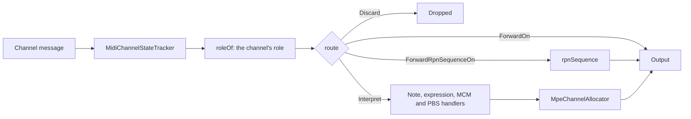

# `MpeTuner` internals

`MpeTuner` tunes polyphonic input by giving each note an MPE Member Channel, whose Pitch Bend carries the tuning offset
of the note's pitch class plus the note's own Expression Pitch Bend. Its design, including where it departs from the
MPE Specification, is in the [MPE Tuner paper](mpe-tuner-paper.md); [`mpe-spec.md`](mpe-spec.md) holds notes on the
specification.

## Message flow

A channel's role, `Master`, `Member`, `NonMpeInput` or `Outside`, follows from the input mode and the Zones. `route`
turns the role, the message and the parameter the input channel holds selected into a verdict. System messages bypass
the routing and pass through.

## Collaborators

- **`MpeMessageRouting`** — the paper's message-handling table, as pure functions: `roleOf`, `route`, and
  `rpnSequence`, which renders a relayed parameter value, preceded by its selector when the output channel holds
  another parameter.
- **`MpeChannelAllocator`** — allocates notes to the Member Channels of one Zone, keeps each note's Expression Values
  and their aggregate per channel, and reports what changed for `MpeTuner` to emit. It holds Expression Pitch Bend in
  raw 14-bit units: only `MpeTuner` knows cents and Pitch Bend Sensitivity, and it injects the High Expression Pitch
  Bend threshold.
- **`MpeExpression`** — the Expression Values of a note or a channel: Pitch Bend, Channel Pressure and CC #74.
- **`MpeZone`**, **`MpeZones`** — the Zone layout and each Zone's Pitch Bend Sensitivities.
- **Output RPN selectors** — `MpeTuner`'s record of the parameter it last left selected on each output channel, so
  that a relayed sequence repeats its selector only when needed.

Only `MpeTuner`, `MpeZone*` and `MpeInputMode` are public, because `format` references them; the rest are
`private[tuner]`.

## Reconfigurations

| Trigger | Allocators | Sent to the receiver |
| ------- | ---------- | -------------------- |
| MPE Configuration Message | Rebuilt by `MpeChannelAllocator.retaining`, keeping the Member Channels the change left untouched | Note Offs on the channels entering or leaving MPE control, each Zone's MCM where it changed and its Pitch Bend Sensitivity, then the retuned Pitch Bends |
| Member Pitch Bend Sensitivity | Kept, with a new High Expression Pitch Bend threshold that may drop diverging notes | The sensitivity, the dropped notes' Note Offs, then the retuned Pitch Bends |
| `reset()` | Recreated empty | Note Offs, the controls it sent back to their defaults, the initial Zones' configuration, then the current tuning |

An MPE Configuration Message also switches the tuner to MPE Input Mode.
