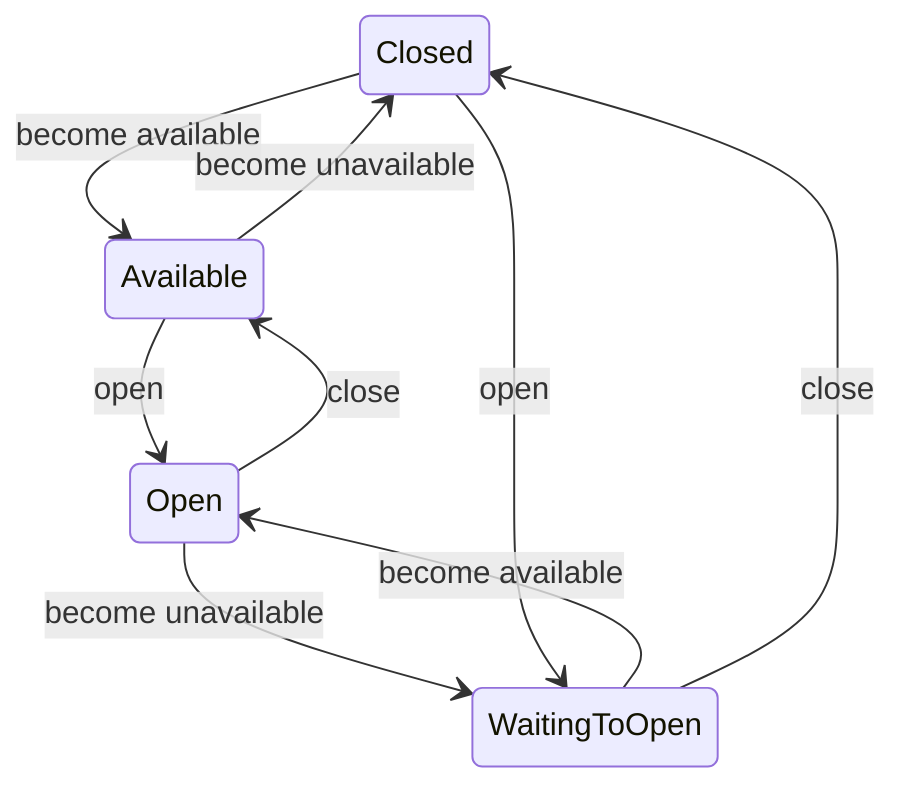
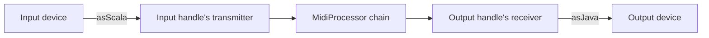
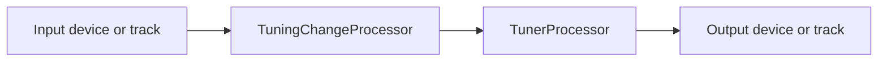
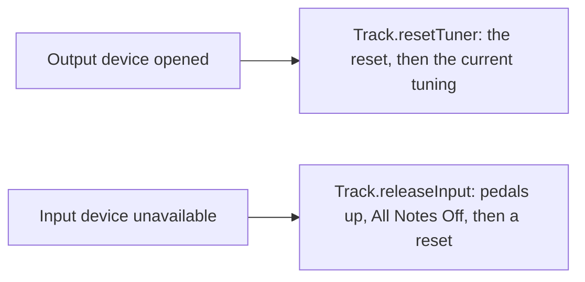
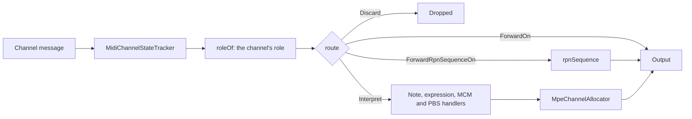

# #359 Documentation conventions Implementation Plan

> **For agentic workers:** REQUIRED SUB-SKILL: Use superpowers:subagent-driven-development (recommended) or
> superpowers:executing-plans to implement this plan task-by-task. Steps use checkbox (`- [ ]`) syntax for tracking.

- Date: 2026-10-09
- Base: `doc/doc-conventions` at `7e8c41ad` (`main` at `a7caffb1`)
- Issue: [#359](https://github.com/calinburloiu/microtonalist/issues/359)

**Goal:** Give agents conventions for every kind of doc, an `architecture-docs` skill with a size check enforced in
CI, and apply them to the docs that drifted most.

**Architecture:** An always-loaded `docs/development/doc-conventions.md` sets the rules for all docs. The on-demand
`architecture-docs` skill carries the architecture-doc specifics and bundles `check_arch_doc_size.py`, a stdlib Python
script that a new `docs` CI job runs. The three most drifted architecture docs are rewritten to the conventions (one
split in two), and `MpeTuner.scala`'s comments are trimmed as a sample.

**Tech Stack:** Markdown with Mermaid, Python 3 stdlib (`argparse`, `unittest`), GitHub Actions, Scala 3 (comments
only).

**Spec:** `issues/00359-doc-conventions/2026-10-09-design.md` (commit `7e8c41ad`). Read it before starting.

## Global Constraints

- Size budget: **1000 words**. **OK** up to 1200; **WARNING** at 1201–1500 (compacting recommended); **ERROR** above
  1500 (compacting required).
- A doc's size is the count of whitespace-separated words of the whole file, code blocks and diagrams included.
- Exemption marker: `<!-- arch-doc-size: exempt (paper) -->` in a doc's first 10 lines; only on papers and notes on
  external specs (`tuner/mpe-tuner-paper.md`, `tuner/mpe-spec.md`).
- Script CLI: `check_arch_doc_size.py [--github] [PATH...]`. Python 3 stdlib only, and it must run on the local
  `python3`, which is **3.9.6**: no `match`, no `X | Y` type annotations, no 3.10+ APIs. Exit code 0 when every doc is
  OK, warned or skipped, 1 on any error, 2 on a usage error.
- An agent using the script treats it as a black box: `--help`, never its source.
- `doc-conventions.md` is always loaded: at most about 700 words.
- `SKILL.md`: at most about 900 words; its `description` gives triggering conditions only, never the workflow.
- Each trimmed doc about 1000 words and OK under the script; `tuner/mpe-tuner.md` about 600; `midi-device-lifecycle.md`
  about 900.
- Diagrams are Mermaid only: `flowchart` for pipelines, `sequenceDiagram` for event and thread hand-offs,
  `stateDiagram-v2` for lifecycles. Quote any node label holding punctuation.
- Keep these headings, which other docs link to by anchor: `### Device handling` (`sc-midi/README.md`),
  `## Device changes` (`tuner/README.md`), `## Subject to change (#305)` (`midi-device-lifecycle.md`).
- `MpeTuner.scala`: comments only. 461 comment lines (after the license header) go down to 200–250. A `//` line stays
  within 120 characters: scalafmt refills ScalaDoc paragraphs but never wraps `//` comments.
- Prose: essentials only, as briefly as a human would write it; describe the current state; cite issue numbers only
  for open work.
- Commit messages: a title `[#359] <imperative summary>`, a blank line, then the attribution trailers from the executing
  session's system reminder. The pre-commit hook adds license headers to new `.py` files and formats staged Scala
  files; it re-stages whole files, so stage whole files.
- No git worktrees in this repository: scratch copies are `git clone`s in the session's scratchpad directory.
- Under `issues/`, read or write only this plan, the design, and `issues/00359-doc-conventions/2026-10-09-skill-tests.md`
  (created in Task 3).

## Review Focus

1. **`%` in a `--github` annotation**, e.g. "128% of the budget": GitHub's workflow commands need it escaped as `%25`,
   or the annotation is garbled. Pinned in Task 1 by `test_annotates_warnings_and_errors_for_github` and
   `test_escapes_the_annotation_file_property`.
2. **A directory as PATH**, e.g. `docs/architecture/tuner`: an agent will pass one, and expects its docs checked rather
   than an `IsADirectoryError` traceback. Pinned in Task 1 by `test_expands_a_directory_given_to_its_docs`.
3. **Default discovery finding nothing**, e.g. after `docs/architecture/` moves: CI must fail (exit 2) rather than pass
   vacuously. Pinned in Task 1 by `test_rejects_finding_no_docs`.
4. **Non-ASCII docs under a C locale**: the docs hold `ș`, `→` and box-drawing characters, and CI or a shell may run
   with `LC_ALL=C`; the script must read UTF-8 regardless. Pinned in Task 1 by
   `test_reads_utf8_docs_whatever_the_locale`.
5. **Links into renamed headings or removed sections**, from any Markdown file in the repository: a rewrite must not
   break `#device-handling`, `#device-changes`, `#subject-to-change-305` or a file link. Pinned by the link check of
   [Appendix A](#appendix-a-link-check), run in Tasks 2–6 and 9.

## File map

| File | Task | Change |
| ---- | ---- | ------ |
| `.claude/skills/architecture-docs/scripts/check_arch_doc_size.py` | 1 | Create: the size check. |
| `.claude/skills/architecture-docs/scripts/tests/test_check_arch_doc_size.py` | 1 | Create: its `unittest` suite. |
| `docs/development/doc-conventions.md` | 2 | Create: the conventions. |
| `AGENTS.md`, `docs/development/README.md`, `CONTRIBUTING.md` | 2 | Wire the conventions in. |
| `.claude/skills/architecture-docs/SKILL.md` | 3 | Create: the skill. |
| `issues/00359-doc-conventions/2026-10-09-skill-tests.md` | 3 | Create: the RED/GREEN results. |
| `docs/development/claude-code-setup.md` | 3, 8 | Describe the skill; mention the CI job. |
| `docs/architecture/midi-device-lifecycle.md` | 4 | Rewrite, about 830 words. |
| `docs/architecture/sc-midi/README.md` | 5 | Rewrite, about 730 words. |
| `docs/architecture/tuner/README.md` | 6 | Rewrite, about 830 words. |
| `docs/architecture/tuner/mpe-tuner.md` | 6 | Create: `MpeTuner`'s internals, about 440 words. |
| `docs/architecture/tuner/mpe-tuner-paper.md`, `docs/architecture/tuner/mpe-spec.md` | 6 | Add the exemption marker. |
| `docs/architecture/README.md` | 6 | Drop the `tuner/mpe-spec.md` entry. |
| `tuner/src/main/scala/org/calinburloiu/music/microtonalist/tuner/MpeTuner.scala` | 7 | Trim the comments. |
| `.github/workflows/scala.yml` | 8 | Add the `docs` job. |

## Execution notes

- In bash blocks, `SCRATCH` is the session's scratchpad directory, an absolute path from the system prompt. Set it
  in each shell (`SCRATCH=/absolute/path`), since shell variables don't persist between commands.
- **Task 3 runs in the controlling session**, not in an implementer subagent: it dispatches subagents of its own, which
  a subagent can't do.
- Every task that edits Markdown ends with the link check of [Appendix A](#appendix-a-link-check). Save that script
  once, as `check_links.py` in the session's scratchpad directory.
- The size check is run from the repository root as
  `python3 .claude/skills/architecture-docs/scripts/check_arch_doc_size.py [PATH...]`. It accepts any Markdown file,
  which Task 2 uses to measure `doc-conventions.md`.
- The texts in Tasks 2 and 4–7 were drafted and verified against the base commit: their word counts, links, anchors
  and named types, and, for `MpeTuner.scala`, the comment-line count and line lengths. Transcribe them exactly.

---

### Task 1: The architecture doc size check

**Files:**
- Create: `.claude/skills/architecture-docs/scripts/check_arch_doc_size.py`
- Test: `.claude/skills/architecture-docs/scripts/tests/test_check_arch_doc_size.py`

**Interfaces:**
- Consumes: nothing.
- Produces:
  - CLI, run from the repository root: `python3 .claude/skills/architecture-docs/scripts/check_arch_doc_size.py
    [--github] [PATH...]`. With no PATH it checks every `docs/architecture/**/*.md` under the repository root, found
    from the script's own location; a PATH may be a file or a directory. One line per doc:
    `<STATUS, padded to 7>  <path>  <N> words (<P>% of the 1000-word budget)`, followed for a WARNING or an ERROR by
    `: compacting recommended above 1200 words: …` or `: compacting required above 1500 words: …`; a skipped doc
    prints `SKIPPED  <path>  <N> words (exempt)`. `--github` adds `::warning file=<path>::…` / `::error file=<path>::…`
    after each warned or failing doc's line.
  - Module API used by the tests: `Status` (`OK`, `WARNING`, `ERROR`, `SKIPPED`), `Result(path, status, words)`,
    `count_words(text) -> int`, `classify(words) -> Status`, `check_file(path) -> Result`,
    `escape_property(value) -> str`, `main(argv, root, out, err) -> int`.
  - Test command: `python3 -m unittest discover -s .claude/skills/architecture-docs/scripts/tests -p "test_*.py"`.

- [ ] **Step 1: Write the failing tests**

Create `.claude/skills/architecture-docs/scripts/tests/test_check_arch_doc_size.py` (no license header: the pre-commit
hook adds it):

```python
"""Tests of check_arch_doc_size.py, run with:

    python3 -m unittest discover -s .claude/skills/architecture-docs/scripts/tests -p "test_*.py"

Most tests call `main` in-process against a throwaway repository root; `CliTest` runs the script itself.
"""

import io
import os
import subprocess
import sys
import tempfile
import unittest
from pathlib import Path

SCRIPTS_DIR = Path(__file__).resolve().parent.parent
sys.path.insert(0, str(SCRIPTS_DIR))

import check_arch_doc_size as size  # noqa: E402

SCRIPT = SCRIPTS_DIR / "check_arch_doc_size.py"
MARKER = "<!-- arch-doc-size: exempt (paper) -->"
HOW = "rephrase, remove details or split; see the architecture-docs skill"


def words(count):
    """A Markdown body of exactly `count` words, ten per line."""
    tokens = ["word"] * count
    return "".join(" ".join(tokens[i:i + 10]) + "\n" for i in range(0, count, 10))


class RepoTestCase(unittest.TestCase):
    """A throwaway repository root, with helpers to write docs and run `main` against it."""

    def setUp(self):
        self._tmp = tempfile.TemporaryDirectory()
        self.addCleanup(self._tmp.cleanup)
        self.root = Path(self._tmp.name)

    def write(self, relative_path, text):
        path = self.root / relative_path
        path.parent.mkdir(parents=True, exist_ok=True)
        path.write_text(text, encoding="utf-8")
        return path

    def run_main(self, *args):
        out, err = io.StringIO(), io.StringIO()
        code = size.main(list(args), root=self.root, out=out, err=err)
        return code, out.getvalue().splitlines(), err.getvalue()


class CountWordsTest(unittest.TestCase):

    def test_counts_whitespace_separated_words(self):
        self.assertEqual(size.count_words("one two\tthree\n\n  four\n"), 4)

    def test_counts_code_blocks_and_diagrams(self):
        text = "```mermaid\nflowchart LR\n  a --> b\n```\n"
        self.assertEqual(size.count_words(text), 7)

    def test_counts_non_ascii_words(self):
        self.assertEqual(size.count_words("Cireșar → ⟶ scale"), 4)

    def test_counts_nothing_in_an_empty_text(self):
        self.assertEqual(size.count_words(""), 0)


class ClassifyTest(unittest.TestCase):

    def test_ok_up_to_1200_words(self):
        self.assertIs(size.classify(0), size.Status.OK)
        self.assertIs(size.classify(1200), size.Status.OK)

    def test_warning_from_1201_to_1500_words(self):
        self.assertIs(size.classify(1201), size.Status.WARNING)
        self.assertIs(size.classify(1500), size.Status.WARNING)

    def test_error_above_1500_words(self):
        self.assertIs(size.classify(1501), size.Status.ERROR)


class CheckFileTest(RepoTestCase):

    def test_skips_a_doc_with_the_marker_on_line_10(self):
        path = self.write("doc.md", "\n" * 9 + MARKER + "\n" + words(2000))
        self.assertIs(size.check_file(path).status, size.Status.SKIPPED)

    def test_checks_a_doc_with_the_marker_on_line_11(self):
        path = self.write("doc.md", "\n" * 10 + MARKER + "\n" + words(2000))
        self.assertIs(size.check_file(path).status, size.Status.ERROR)

    def test_skips_a_doc_with_the_marker_surrounded_by_whitespace(self):
        path = self.write("doc.md", "# Paper\n\n  " + MARKER + "  \n" + words(2000))
        self.assertIs(size.check_file(path).status, size.Status.SKIPPED)

    def test_reports_the_word_count(self):
        path = self.write("doc.md", words(1234))
        self.assertEqual(size.check_file(path), size.Result(path, size.Status.WARNING, 1234))


class MainTest(RepoTestCase):

    def test_checks_every_doc_under_docs_architecture_by_default(self):
        # Given
        self.write("docs/architecture/b/README.md", words(10))
        self.write("docs/architecture/a.md", words(10))
        self.write("docs/architecture/notes.txt", words(10))
        self.write("docs/development/guide.md", words(10))

        # When
        code, lines, _ = self.run_main()

        # Then
        self.assertEqual(code, 0)
        self.assertEqual([line.split()[1] for line in lines],
                         ["docs/architecture/a.md", "docs/architecture/b/README.md"])

    def test_checks_only_the_paths_given(self):
        # Given
        self.write("docs/architecture/a.md", words(10))
        given = self.write("docs/architecture/b.md", words(10))

        # When
        code, lines, _ = self.run_main(str(given))

        # Then
        self.assertEqual(code, 0)
        self.assertEqual([line.split()[1] for line in lines], ["docs/architecture/b.md"])

    def test_expands_a_directory_given_to_its_docs(self):
        # Given
        self.write("docs/architecture/tuner/README.md", words(10))
        self.write("docs/architecture/tuner/mpe.md", words(10))
        self.write("docs/architecture/other.md", words(10))

        # When
        code, lines, _ = self.run_main(str(self.root / "docs/architecture/tuner"))

        # Then
        self.assertEqual(code, 0)
        self.assertEqual([line.split()[1] for line in lines],
                         ["docs/architecture/tuner/README.md", "docs/architecture/tuner/mpe.md"])

    def test_prints_status_path_words_and_percentage(self):
        # Given
        self.write("docs/architecture/a.md", words(1000))

        # When
        _, lines, _ = self.run_main()

        # Then
        self.assertEqual(lines, ["OK       docs/architecture/a.md  1000 words (100% of the 1000-word budget)"])

    def test_tells_how_to_compact_a_doc_with_a_warning(self):
        # Given
        self.write("docs/architecture/a.md", words(1283))

        # When
        code, lines, _ = self.run_main()

        # Then
        self.assertEqual(code, 0)
        self.assertEqual(lines, ["WARNING  docs/architecture/a.md  1283 words (128% of the 1000-word budget): "
                                 "compacting recommended above 1200 words: " + HOW])

    def test_fails_and_tells_how_to_compact_a_doc_with_an_error(self):
        # Given
        self.write("docs/architecture/a.md", words(1501))
        self.write("docs/architecture/b.md", words(10))

        # When
        code, lines, _ = self.run_main()

        # Then
        self.assertEqual(code, 1)
        self.assertEqual(lines, [
            "ERROR    docs/architecture/a.md  1501 words (150% of the 1000-word budget): "
            "compacting required above 1500 words: " + HOW,
            "OK       docs/architecture/b.md  10 words (1% of the 1000-word budget)",
        ])

    def test_reports_an_exempt_doc_as_skipped(self):
        # Given
        self.write("docs/architecture/paper.md", MARKER + "\n" + words(5000))

        # When
        code, lines, _ = self.run_main()

        # Then
        self.assertEqual(code, 0)
        self.assertEqual(lines, ["SKIPPED  docs/architecture/paper.md  5005 words (exempt)"])

    def test_prints_no_annotations_without_the_github_flag(self):
        # Given
        self.write("docs/architecture/a.md", words(1501))

        # When
        _, lines, _ = self.run_main()

        # Then
        self.assertFalse([line for line in lines if line.startswith("::")])

    def test_annotates_warnings_and_errors_for_github(self):
        # Given
        self.write("docs/architecture/error.md", words(1501))
        self.write("docs/architecture/ok.md", words(10))
        self.write("docs/architecture/paper.md", MARKER + "\n" + words(5000))
        self.write("docs/architecture/warning.md", words(1283))

        # When
        code, lines, _ = self.run_main("--github")

        # Then
        self.assertEqual(code, 1)
        self.assertEqual([line for line in lines if line.startswith("::")], [
            "::error file=docs/architecture/error.md::1501 words (150%25 of the 1000-word budget): "
            "compacting required above 1500 words: " + HOW,
            "::warning file=docs/architecture/warning.md::1283 words (128%25 of the 1000-word budget): "
            "compacting recommended above 1200 words: " + HOW,
        ])

    def test_escapes_the_annotation_file_property(self):
        self.assertEqual(size.escape_property("a:b,c%d"), "a%3Ab%2Cc%25d")

    def test_rejects_a_missing_path(self):
        # Given
        self.write("docs/architecture/a.md", words(10))

        # When
        code, lines, err = self.run_main(str(self.root / "docs/architecture/missing.md"))

        # Then
        self.assertEqual(code, 2)
        self.assertEqual(lines, [])
        self.assertIn("missing.md", err)

    def test_rejects_finding_no_docs(self):
        # Given
        self.write("docs/development/guide.md", words(10))

        # When
        code, lines, err = self.run_main()

        # Then
        self.assertEqual(code, 2)
        self.assertEqual(lines, [])
        self.assertIn("no Markdown docs", err)


class CliTest(unittest.TestCase):

    def run_script(self, *args, env=None):
        return subprocess.run([sys.executable, str(SCRIPT), *args], capture_output=True, text=True, env=env)

    def test_prints_its_usage(self):
        result = self.run_script("--help")
        self.assertEqual(result.returncode, 0)
        self.assertIn("--github", result.stdout)
        self.assertIn("arch-doc-size: exempt (paper)", result.stdout)

    def test_reads_utf8_docs_whatever_the_locale(self):
        # Given
        with tempfile.TemporaryDirectory() as tmp:
            doc = Path(tmp) / "doc.md"
            doc.write_text("Cireșar → ⟶ scale\n", encoding="utf-8")
            env = dict(os.environ, LC_ALL="C", LANG="C", PYTHONUTF8="0")

            # When
            result = self.run_script(str(doc), env=env)

        # Then
        self.assertEqual(result.returncode, 0, result.stderr)
        self.assertIn("4 words", result.stdout)


if __name__ == "__main__":
    unittest.main()
```

- [ ] **Step 2: Write the thinnest stub**

Create `.claude/skills/architecture-docs/scripts/check_arch_doc_size.py`, so that the tests import it and fail on
their assertions rather than on an `ImportError`:

```python
#!/usr/bin/env python3
"""Checks the size of the architecture docs against their word budget. Run it with --help for its usage."""

import sys
from enum import Enum
from pathlib import Path
from typing import List, NamedTuple, Optional, TextIO


class Status(Enum):
    OK = "OK"
    WARNING = "WARNING"
    ERROR = "ERROR"
    SKIPPED = "SKIPPED"


class Result(NamedTuple):
    path: Path
    status: Status
    words: int


def count_words(text: str) -> int:
    raise NotImplementedError


def classify(words: int) -> Status:
    raise NotImplementedError


def check_file(path: Path) -> Result:
    raise NotImplementedError


def escape_property(value: str) -> str:
    raise NotImplementedError


def main(argv: Optional[List[str]] = None, root: Path = Path("."), out: TextIO = sys.stdout,
         err: TextIO = sys.stderr) -> int:
    raise NotImplementedError


if __name__ == "__main__":
    sys.exit(main())
```

- [ ] **Step 3: Run the tests to watch them fail**

Run: `python3 -m unittest discover -s .claude/skills/architecture-docs/scripts/tests -p "test_*.py"`

Expected: `Ran 25 tests` and `FAILED (failures=2, errors=23)`: 23 errors raising `NotImplementedError`, and the two
`CliTest` cases failing because the script exits 1 instead of 0.

- [ ] **Step 4: Write the implementation**

Replace the whole of `check_arch_doc_size.py` with:

```python
#!/usr/bin/env python3
"""Checks the size of the architecture docs against their word budget. Run it with --help for its usage."""

import argparse
import sys
from enum import Enum
from pathlib import Path
from typing import List, NamedTuple, Optional, TextIO

BUDGET_WORDS = 1000
OK_MAX_WORDS = 1200
WARNING_MAX_WORDS = 1500
EXEMPTION_MARKER = "<!-- arch-doc-size: exempt (paper) -->"
MARKER_MAX_LINE = 10
ARCHITECTURE_DIR = Path("docs") / "architecture"
# This file is <root>/.claude/skills/architecture-docs/scripts/check_arch_doc_size.py.
REPO_ROOT = Path(__file__).resolve().parents[4]

COMPACTING = "rephrase, remove details or split; see the architecture-docs skill"


class Status(Enum):
    OK = "OK"
    WARNING = "WARNING"
    ERROR = "ERROR"
    SKIPPED = "SKIPPED"


INSTRUCTIONS = {
    Status.WARNING: f"compacting recommended above {OK_MAX_WORDS} words: {COMPACTING}",
    Status.ERROR: f"compacting required above {WARNING_MAX_WORDS} words: {COMPACTING}",
}
ANNOTATION_LEVELS = {Status.WARNING: "warning", Status.ERROR: "error"}


class Result(NamedTuple):
    path: Path
    status: Status
    words: int


def count_words(text: str) -> int:
    """Counts the whitespace-separated words of a doc, code blocks and diagrams included."""
    return len(text.split())


def is_exempt(text: str) -> bool:
    return any(EXEMPTION_MARKER in line for line in text.splitlines()[:MARKER_MAX_LINE])


def classify(words: int) -> Status:
    if words <= OK_MAX_WORDS:
        return Status.OK
    if words <= WARNING_MAX_WORDS:
        return Status.WARNING
    return Status.ERROR


def check_file(path: Path) -> Result:
    text = path.read_text(encoding="utf-8")
    words = count_words(text)
    return Result(path, Status.SKIPPED if is_exempt(text) else classify(words), words)


def budget_share(words: int) -> str:
    return f"{words * 100 // BUDGET_WORDS}% of the {BUDGET_WORDS}-word budget"


def format_line(result: Result, display: str) -> str:
    detail = "exempt" if result.status is Status.SKIPPED else budget_share(result.words)
    line = f"{result.status.value:<7}  {display}  {result.words} words ({detail})"
    instruction = INSTRUCTIONS.get(result.status)
    return f"{line}: {instruction}" if instruction else line


def escape_data(value: str) -> str:
    """Escapes an annotation message, as GitHub Actions workflow commands require."""
    return value.replace("%", "%25").replace("\r", "%0D").replace("\n", "%0A")


def escape_property(value: str) -> str:
    """Escapes an annotation property, such as `file`, as GitHub Actions workflow commands require."""
    return escape_data(value).replace(":", "%3A").replace(",", "%2C")


def format_annotation(result: Result, display: str) -> Optional[str]:
    level = ANNOTATION_LEVELS.get(result.status)
    if level is None:
        return None
    message = f"{result.words} words ({budget_share(result.words)}): {INSTRUCTIONS[result.status]}"
    return f"::{level} file={escape_property(display)}::{escape_data(message)}"


def discover(directory: Path) -> List[Path]:
    return sorted(path for path in directory.rglob("*.md") if path.is_file())


def display_path(path: Path, root: Path) -> str:
    try:
        return path.resolve().relative_to(root.resolve()).as_posix()
    except ValueError:
        return str(path)


def parse_args(argv: Optional[List[str]]) -> argparse.Namespace:
    parser = argparse.ArgumentParser(
        prog="check_arch_doc_size.py",
        formatter_class=argparse.RawDescriptionHelpFormatter,
        description=(
            f"Checks the word count of architecture docs against their budget of {BUDGET_WORDS} words:\n"
            f"OK up to {OK_MAX_WORDS} words, WARNING up to {WARNING_MAX_WORDS} (compacting recommended),\n"
            f"ERROR above (compacting required). A doc with {EXEMPTION_MARKER}\n"
            f"in its first {MARKER_MAX_LINE} lines is SKIPPED."),
        epilog="Exit status: 0 when no doc is in ERROR, 1 when one is, 2 on a usage error.")
    parser.add_argument("--github", action="store_true",
                        help="also print GitHub Actions annotations for the warnings and errors")
    parser.add_argument("paths", nargs="*", type=Path, metavar="PATH",
                        help="a doc, or a directory of docs, to check (default: every doc under docs/architecture/)")
    return parser.parse_args(argv)


def main(argv: Optional[List[str]] = None, root: Path = REPO_ROOT, out: TextIO = sys.stdout,
         err: TextIO = sys.stderr) -> int:
    args = parse_args(argv)

    missing = [str(path) for path in args.paths if not path.exists()]
    if missing:
        print(f"error: no such file or directory: {', '.join(missing)}", file=err)
        return 2

    if args.paths:
        targets = [doc for path in args.paths for doc in (discover(path) if path.is_dir() else [path])]
    else:
        targets = discover(root / ARCHITECTURE_DIR)
    if not targets:
        print("error: no Markdown docs to check", file=err)
        return 2

    results = [check_file(path) for path in targets]
    for result in results:
        display = display_path(result.path, root)
        print(format_line(result, display), file=out)
        annotation = format_annotation(result, display) if args.github else None
        if annotation:
            print(annotation, file=out)

    return 1 if any(result.status is Status.ERROR for result in results) else 0


if __name__ == "__main__":
    sys.exit(main())
```

- [ ] **Step 5: Run the tests to watch them pass**

Run: `python3 -m unittest discover -s .claude/skills/architecture-docs/scripts/tests -p "test_*.py"`

Expected: `Ran 25 tests` … `OK`.

- [ ] **Step 6: Run it over the repository**

Run: `python3 .claude/skills/architecture-docs/scripts/check_arch_doc_size.py; echo "exit=$?"`

Expected, until Tasks 4–6 trim the docs: `WARNING` for `format/README.md` (1283 words), `ERROR` for
`midi-device-lifecycle.md` (1638), `sc-midi/README.md` (4983), `tuner/README.md` (3430), `tuner/mpe-spec.md` (5772)
and `tuner/mpe-tuner-paper.md` (21846), `OK` for every other doc, and `exit=1`.

- [ ] **Step 7: Commit**

```bash
git add .claude/skills/architecture-docs/scripts
git commit -F - <<'EOF'
[#359] Add the architecture doc size check

<attribution trailers>
EOF
head -3 .claude/skills/architecture-docs/scripts/check_arch_doc_size.py
```

Replace `<attribution trailers>` with the trailers from the session's system reminder. Expected from `head`: the
shebang, then the license header the hook added.

---

### Task 2: The documentation conventions

**Files:**
- Create: `docs/development/doc-conventions.md`
- Modify: `AGENTS.md` (the *Documentation* final check, about line 36; *Per-module deep dives*, about line 156;
  *Coding Conventions*, about line 182)
- Modify: `docs/development/README.md:11`, `CONTRIBUTING.md:18`

**Interfaces:**
- Consumes: the size check of Task 1, to measure the doc.
- Produces: `docs/development/doc-conventions.md`, always loaded through `AGENTS.md`, and the instruction to invoke the
  `architecture-docs` skill (created in Task 3) from the *Documentation* final check.

- [ ] **Step 1: Write the conventions**

Create `docs/development/doc-conventions.md`:

````markdown
# Documentation Conventions

Conventions for every kind of documentation in this repository: ScalaDoc, code comments, Markdown docs and agent
instructions. Code conventions live in [`coding-conventions.md`](coding-conventions.md).

## General rules

- **Essentials only.** Write what the reader needs, as briefly as a human would write it.
- **Don't restate the code.** Say what the code can't: purpose, contract, constraints, the reason for a non-obvious
  choice. A reader who has the code shouldn't have to read it again in prose.
- **One home per fact.** Each fact lives in the kind of doc the table below gives it. Elsewhere, link to it instead of
  copying it.
- **Describe the current state.** History lives in git, the PRs and the release notes.
- **Cite issue numbers only for open work:** a `TODO #n`, an area that is subject to change, a known limitation.

## Kinds of docs

| Kind | Location | Purpose |
| ---- | -------- | ------- |
| ScalaDoc | public identifiers | The contract of the identifier. |
| Code comments | code | Why the code does something non-obvious. |
| Architecture docs | `docs/architecture/` | An overview that orients a reader in a module; see the `architecture-docs` skill. |
| Development guides | `docs/development/` | How-to guides for human developers. |
| Agent docs | `AGENTS.md`, `docs/agents/`, `.claude/skills/` | Imperative instructions. The facts an agent needs stay in always-loaded context; their rationale goes in a doc loaded on demand. |
| READMEs | a directory's root | What the directory holds and how to start. |
| Papers and reference notes | e.g. `docs/architecture/tuner/mpe-tuner-paper.md` and `mpe-spec.md` | A design paper, or notes on an external specification. |
| Release notes | `docs/release-notes.md` | What changed for users in each release; see the `release` skill. |

## ScalaDoc

A ScalaDoc states a contract:

1. a one-sentence summary;
2. then, only where a caller can't infer it from the signature: units, failure behaviour, thread-safety and
   non-obvious constraints.

How the implementation works isn't part of the contract. A rationale that takes a paragraph belongs in the
architecture doc or the paper; cite its section by name.

## Code comments

A comment gives a non-obvious *why*: an ordering that matters, an invariant, a workaround. It never repeats what the
next line says, and it stays within a sentence or two, pointing to the architecture doc or the paper for a longer
rationale.

## Papers

Papers use a technical academic tone: precise definitions, each claim followed by its justification, no conversational
asides. Their length isn't capped, but their prose stays tight.
````

- [ ] **Step 2: Wire it into `AGENTS.md`**

Replace

```markdown
    - **Documentation**. Update documentation (ScalaDocs in code for all public identifiers, architecture docs, READMEs,
      guides etc.) and agent artifacts.
```

with

```markdown
    - **Documentation**. Update documentation (ScalaDocs in code for all public identifiers, architecture docs, READMEs,
      guides etc.) and agent artifacts, following the documentation conventions. When the change affects a document
      under `docs/architecture/`, invoke the `architecture-docs` skill.
```

Replace

```markdown
- **Per-module deep dives (`docs/architecture/$MODULE/README.md`)** — one document per module (an architecture document
  covering responsibility, key types, dependencies, and module-specific concerns). Each module's `$MODULE/CLAUDE.md`
```

with

```markdown
- **Per-module deep dives (`docs/architecture/$MODULE/README.md`)** — one document per module (an architecture document
  covering responsibility, key types, flows, and module-specific concerns). Each module's `$MODULE/CLAUDE.md`
```

Replace

```markdown
Follow these conventions whenever you write code. They are imported here so they are always in context:

- Production / general Scala conventions: @docs/development/coding-conventions.md
- Test conventions (directory layout, naming, BDD style, Given/When/Then, fixtures, shared test utilities):
  @docs/development/test-conventions.md
```

with

```markdown
Follow these conventions whenever you write code or documentation. They are imported here so they are always in
context:

- Production / general Scala conventions: @docs/development/coding-conventions.md
- Test conventions (directory layout, naming, BDD style, Given/When/Then, fixtures, shared test utilities):
  @docs/development/test-conventions.md
- Documentation conventions (ScalaDoc, comments, Markdown docs, agent docs): @docs/development/doc-conventions.md
```

- [ ] **Step 3: List it in the development README and `CONTRIBUTING.md`**

In `docs/development/README.md`, after the line
``- [`test-conventions.md`](test-conventions.md) — conventions for writing tests.``, add:

```markdown
- [`doc-conventions.md`](doc-conventions.md) — conventions for ScalaDoc, comments and Markdown docs.
```

In `CONTRIBUTING.md`, after the line starting ``- [Test conventions](docs/development/test-conventions.md)``, add:

```markdown
- [Documentation conventions](docs/development/doc-conventions.md) — ScalaDoc, comments and Markdown docs.
```

- [ ] **Step 4: Check its size and links**

Run: `python3 .claude/skills/architecture-docs/scripts/check_arch_doc_size.py docs/development/doc-conventions.md`

Expected: `OK       docs/development/doc-conventions.md  429 words (42% of the 1000-word budget)`. The budget doesn't
apply to this doc; the count shows it stays within the 700 words of the Global Constraints.

Run the link check ([Appendix A](#appendix-a-link-check)). Expected: `No broken links.`

- [ ] **Step 5: Commit**

```bash
git add docs/development/doc-conventions.md AGENTS.md docs/development/README.md CONTRIBUTING.md
git commit -F - <<'EOF'
[#359] Add the documentation conventions

<attribution trailers>
EOF
```

---

### Task 3: The `architecture-docs` skill

**Runs in the controlling session** (it dispatches subagents).

**Files:**
- Create: `.claude/skills/architecture-docs/SKILL.md`
- Create: `issues/00359-doc-conventions/2026-10-09-skill-tests.md`
- Modify: `docs/development/claude-code-setup.md` (*Skills* section, after the `release` skill subsection)
- Scratch, not committed: `$SCRATCH/arch-docs-*` clones

**Interfaces:**
- Consumes: the size script (Task 1), `doc-conventions.md` (Task 2).
- Produces: the skill `architecture-docs`, whose `SKILL.md` invokes the script as
  `python3 .claude/skills/architecture-docs/scripts/check_arch_doc_size.py [--github] [PATH...]`.

This task follows `superpowers:writing-skills`: watch agents fail without the skill (RED), write the skill against the
failures seen, watch them pass with it (GREEN), and close loopholes (REFACTOR). The scenarios run on
`format/README.md`, which this PR leaves untrimmed. The commands run from the repository root.

- [ ] **Step 1: Load the skill-writing method**

Invoke `superpowers:writing-skills`, and create a todo for each item of its checklist.

- [ ] **Step 2: Prepare the RED clones**

```bash
SCRATCH=/absolute/path/of/the/session/scratchpad
for run in red-add-1 red-add-2 red-trim-1 red-trim-2; do
  rm -rf "$SCRATCH/arch-docs-$run"
  git clone --quiet "$PWD" "$SCRATCH/arch-docs-$run"
done
python3 - "$SCRATCH/arch-docs-red-add-1" "$SCRATCH/arch-docs-red-add-2" <<'EOF'
import subprocess, sys
for clone in sys.argv[1:]:
    path = f"{clone}/docs/architecture/format/README.md"
    text = open(path, encoding="utf-8").read()
    start, end = text.index("## Deferred reads"), text.index("## `FormatModule`")
    text = (text[:start] + text[end:]).replace(" — see [Deferred\nreads](#deferred-reads)", "")
    open(path, "w", encoding="utf-8").write(text)
    subprocess.run(["git", "-C", clone, "commit", "--quiet", "-am", "Remove the Deferred reads section"], check=True)
EOF
for run in red-add-1 red-trim-1; do
  (cd "$SCRATCH/arch-docs-$run" && python3 .claude/skills/architecture-docs/scripts/check_arch_doc_size.py \
    docs/architecture/format/README.md)
done
```

Expected: the add clones start at 1185 words (the removed section had 94), the trim clones at 1283. The clones
come from the branch's last commit, so they hold Tasks 1 and 2.

- [ ] **Step 3: Run the RED scenarios**

Dispatch four `general-purpose` subagents in one message, one per clone, each with its prompt below, `<CLONE>` replaced
by the clone's absolute path.

The *add* prompt, for `red-add-1` and `red-add-2`:

```text
You are working in the microtonalist repository checked out at <CLONE>, not in the current directory. Run every shell
command from <CLONE>, and read and edit files there only.

First read <CLONE>/docs/development/doc-conventions.md, the project's documentation conventions.

Task: the `format` module's deferred loading of scales — `DeferrableRead`, which `JsonCompositionFormat.readAsync`
uses — isn't documented in <CLONE>/docs/architecture/format/README.md. Document it there, so that the next developer
reading the doc understands it. Read the code under <CLONE>/format/src/main/scala as you need. Edit only that README,
and don't commit.

The `architecture-docs` skill isn't available; don't look for it.

When you're done, reply with: the text you added, verbatim; every shell command you ran; every file you read.
```

The *trim* prompt, for `red-trim-1` and `red-trim-2`:

```text
You are working in the microtonalist repository checked out at <CLONE>, not in the current directory. Run every shell
command from <CLONE>, and read and edit files there only.

First read <CLONE>/docs/development/doc-conventions.md, the project's documentation conventions.

Task: <CLONE>/docs/architecture/format/README.md has grown too long. Trim it. Read the code under
<CLONE>/format/src/main/scala as you need. Edit only that README, and don't commit.

The `architecture-docs` skill isn't available; don't look for it.

When you're done, reply with: what you removed or rewrote, and why; every shell command you ran; every file you read.
```

- [ ] **Step 4: Score the RED runs**

For each clone:

```bash
(cd "$SCRATCH/arch-docs-<run>" && git status --short && \
  python3 .claude/skills/architecture-docs/scripts/check_arch_doc_size.py docs/architecture/format/README.md && \
  git diff docs/architecture/format/README.md)
```

Read every diff in full, and create `issues/00359-doc-conventions/2026-10-09-skill-tests.md`:

```markdown
# #359 `architecture-docs` skill tests

- Date: 2026-10-09
- Base: `doc/doc-conventions` at `<short SHA of the Task 2 commit>`

Each run is a fresh `general-purpose` subagent in a clone of the branch, told to read `doc-conventions.md` first.

- **add**: document `DeferrableRead` in `docs/architecture/format/README.md`, whose *Deferred reads* section
  (94 words) was removed first.
- **trim**: trim `docs/architecture/format/README.md` (1283 words, a warning).

| Run | Words, before → after | Status | Restates the code | *Dependencies* kept | History | Diagram for a flow | Ran the size script | Read the script's source |
| --- | --------------------- | ------ | ----------------- | ------------------- | ------- | ------------------ | ------------------- | ------------------------ |

## RED

## GREEN
```

Add one table row per run. Under "Restates the code", name what the text holds that ScalaDoc or the code owns (method
lists, `private` members, mechanics such as caching or load status), or write "no". Under *RED*, quote the agents'
own justifications verbatim and list the failure patterns seen in more than one run.

- [ ] **Step 5: Classify the failures**

For each RED failure pattern, pick its form from writing-skills' *Match the Form to the Failure*: an output of the
wrong shape (too long, restating the code) takes a positive recipe of what the doc is, not a list of prohibitions; an
omitted element takes a required slot; a behaviour that depends on a condition takes a conditional on an observable
predicate. A point where RED already complies gets no guidance beyond what the spec requires.

- [ ] **Step 6: Write the skill**

Create `.claude/skills/architecture-docs/SKILL.md` from the text below, which covers every item the spec requires (its
section 2, items 1–9). Then add a `## Common mistakes` section, a table of *Mistake* and *Instead*, with one row per
RED failure pattern that the text doesn't already prevent, in the form Step 5 chose. Stay within about 900 words.

````markdown
---
name: architecture-docs
description: >-
  Use when writing, updating, splitting or reviewing a document under docs/architecture/, including the Documentation
  step of a change that adds, removes or reshapes a module's key types or internal flows.
---

# Architecture docs

An architecture doc orients a human or an agent in a module: its responsibility, its few most important types, and how
things flow inside it and across its boundary. It tells the reader which types to look at; their ScalaDoc holds the
details. The documentation conventions (`docs/development/doc-conventions.md`) apply too.

## What goes where

| Content | Home |
| ------- | ---- |
| Responsibility, key types, flows, threading, open work | the architecture doc |
| A type's methods, parameters, edge cases and mechanics | its ScalaDoc |
| `private` and `protected` members | the code |
| Which modules depend on which | `build.sbt` and `docs/architecture/module-overview.md` |
| How the code got here | git, the PRs and the release notes |

Mention a dependency only where it matters to the picture. A `private[module]` type gets one line when it is a main
stage of an internal flow.

## Shape

A module README usually has these sections; leave out one with nothing to say:

1. **Responsibility** — what the module does, and what it leaves to other modules.
2. **Key types** — grouped, one or two lines each: the type's role, not its API.
3. **Flows** — how a message, event or request moves through the types: a diagram and a few sentences.
4. **Threading** — which thread runs what, when it matters.
5. **Subject to change** — one line per open issue that will change the picture.

## Diagrams

Draw flows in Mermaid, which GitHub renders: `flowchart` for pipelines, `sequenceDiagram` for event and thread
hand-offs, `stateDiagram-v2` for lifecycles. Keep a diagram to a few nodes, and let it replace prose rather than
repeat it. Quote a label that holds punctuation: `a["Track.tune, for every track"]`.

## Size budget

The budget is 1000 words, about two pages. Check it with the bundled script, from the repository root:

```bash
python3 .claude/skills/architecture-docs/scripts/check_arch_doc_size.py [--github] [PATH...]
```

With no path it checks every doc under `docs/architecture/`. Up to 1200 words is OK; 1201–1500 warns, compacting
recommended; above 1500 is an error that fails CI, compacting required. The script is a black box: use `--help` for
its usage, and don't read its source.

To compact a doc, in this order: rephrase; remove what ScalaDoc owns; split.

## Splitting

Split a doc that is over budget and covers several capabilities. Move one capability to
`docs/architecture/<module>/<topic>.md`, which has the same budget. The module README keeps one sentence summarising it
and a link to it, and is the only doc linking to it. `docs/architecture/README.md` lists, under *Other architecture
material*, only docs that span modules, and the papers.

## Maintenance checklist

When a change touches what a doc describes:

1. Check that every type the doc names still exists, with Metals `glob-search`.
2. Check that the flows still hold.
3. Remove what the change turned into a detail.
4. Run the size script.
5. Fix the links into headings you renamed: `grep -rn '<file>.md#' --include='*.md' .`

## Exemption

A paper, or a note on an external specification, is exempt from the budget. Mark it in its first 10 lines with:

```markdown
<!-- arch-doc-size: exempt (paper) -->
```

No other doc takes the marker.
````

- [ ] **Step 7: Prepare the GREEN clones**

```bash
for run in green-add-1 green-add-2 green-trim-1 green-trim-2; do
  rm -rf "$SCRATCH/arch-docs-$run"
  git clone --quiet "$PWD" "$SCRATCH/arch-docs-$run"
  mkdir -p "$SCRATCH/arch-docs-$run/.claude/skills/architecture-docs"
  cp .claude/skills/architecture-docs/SKILL.md "$SCRATCH/arch-docs-$run/.claude/skills/architecture-docs/"
done
```

Then run the Python snippet of Step 2 on `green-add-1` and `green-add-2`.

- [ ] **Step 8: Run the GREEN scenarios**

Dispatch four `general-purpose` subagents in one message, with the prompts of Step 3, except that the line
"The `architecture-docs` skill isn't available; don't look for it." becomes:

```text
Then read <CLONE>/.claude/skills/architecture-docs/SKILL.md, the project skill for this task, and follow it.
```

- [ ] **Step 9: Score the GREEN runs**

Score them as in Step 4, adding their rows and observations to the results file. A run passes when:

- **add**: the added text is at most 150 words; it gives `DeferrableRead`'s role and where it sits in the read flow,
  without mechanics that ScalaDoc owns; the doc stays OK or WARNING; the agent ran the size script and didn't read its
  source.
- **trim**: the doc is at most 1000 words; the *Dependencies* section is gone; the `*Format` / `*Repo` pattern, the
  URI-scheme dispatch, `$ref` preprocessing, plugin (de)serialization, deferred reads and `FormatModule` each keep at
  least a sentence; no fact is added; the agent ran the size script and didn't read its source.

- [ ] **Step 10: Close the loopholes**

For each failing run: quote the agent's justification in the results file, change `SKILL.md` in the form Step 5 gives
that failure, re-create that run's clone as in Step 7, and run its scenario again. Re-run the passing scenarios too
after a change to `SKILL.md`. After three rounds with a failure left, stop and ask the user, with the failing diffs.

- [ ] **Step 11: Check the skill**

```bash
python3 .claude/skills/architecture-docs/scripts/check_arch_doc_size.py .claude/skills/architecture-docs/SKILL.md
python3 .claude/skills/architecture-docs/scripts/check_arch_doc_size.py --help
```

Expected: at most about 900 words; the usage prints. Check by eye that the frontmatter has only `name` and
`description`, and that the description starts with "Use when" and summarises no workflow.

- [ ] **Step 12: Describe the skill for humans**

In `docs/development/claude-code-setup.md`, after the ``### `release` skill`` subsection and before
`## Authorizing MCP Servers and Plugins`, add:

````markdown
### `architecture-docs` skill

[`.claude/skills/architecture-docs/SKILL.md`](../../.claude/skills/architecture-docs/SKILL.md) tells Claude what an
architecture doc under `docs/architecture/` holds, how to draw its flows in Mermaid, and how to keep it within its
budget of 1000 words, splitting it when needed. Its bundled script checks the budget, and has a `unittest` suite:

```bash
python3 .claude/skills/architecture-docs/scripts/check_arch_doc_size.py
python3 -m unittest discover -s .claude/skills/architecture-docs/scripts/tests -p "test_*.py"
```
````

Run the link check ([Appendix A](#appendix-a-link-check)). Expected: `No broken links.`

- [ ] **Step 13: Commit**

```bash
git add .claude/skills/architecture-docs/SKILL.md docs/development/claude-code-setup.md \
  issues/00359-doc-conventions/2026-10-09-skill-tests.md
git commit -F - <<'EOF'
[#359] Add the architecture-docs skill

<attribution trailers>
EOF
```

---

### Task 4: Trim `midi-device-lifecycle.md`

**Files:**
- Modify: `docs/architecture/midi-device-lifecycle.md` (whole file)

**Interfaces:**
- Consumes: the size check (Task 1).
- Produces: the heading `## Subject to change (#305)`, anchor `#subject-to-change-305`, which `tuner/README.md` links
  to (Task 6).

`MidiProcessor`'s ScalaDoc already cites this doc by file only, so it needs no change. The rewrite keeps the three-pair
table, the "never say *connect*" rule and a short section per pair; adds a `stateDiagram-v2` of
`MidiDeviceHandle.State`; merges "How the three relate" into the attach/open rule, the four "a request isn't its effect"
bullets and the two error cases; shrinks the #305 section to bullets; and drops *Related documents*.

- [ ] **Step 1: Replace the file**

Replace the whole of `docs/architecture/midi-device-lifecycle.md` with:

````markdown
# MIDI device lifecycle: available/unavailable, open/closed, attached/detached

Three pairs of terms describe where a MIDI device stands. Each pair answers a different question, and knowing one tells
nothing about the other two:

| Pair | Question it answers | Applies to | Owned by |
| ---- | ------------------- | ---------- | -------- |
| **available** / **unavailable** | Is the device present in the system? | a MIDI device only | `MidiDeviceHandle` (`sc-midi`) |
| **open** / **closed** | Does the application hold the device reserved for I/O? | a MIDI device only | `MidiManager` (`sc-midi`) |
| **attached** / **detached** | Is a receiver wired to a transmitter, so messages flow? | a track input/output: a device **or** another track | `MidiProcessor` (`sc-midi`) |

Use exactly these words in code, ScalaDoc, log messages and docs. Never say *connect* or *disconnect*: the word reads
naturally for all three pairs, so it tells none of them apart. Likewise, never say *attached* for a device the platform
reports as present.

## Available / unavailable

**Available** means present in the system: the platform reports the device, so it can be opened. A `MidiManager`
finds out on `refresh()`, which also runs whenever the platform reports a change, and only the manager makes a handle
available or unavailable. `MidiDeviceHandle.info` is defined only while the handle is available. Unplugging a cable, a
virtual port disappearing or a device being replugged all change this pair. Events: `MidiDeviceAvailableEvent` /
`MidiDeviceUnavailableEvent`, or their `…FailedTo…` counterparts.

## Open / closed

**Open** means the application reserved the device for I/O: messages go out through `handle.receiver` and come in
through `handle.transmitter`. `MidiManager.openDevice` requests it and `closeDevice` releases it. Both are
reference-counted, so the device closes only with its last reference and releasing it for one track doesn't silence
the others. Requesting a device that isn't available doesn't fail: the handle waits for it. Events:
`MidiDeviceOpenedEvent` / `MidiDeviceClosedEvent`, or their `…FailedTo…` counterparts.

The two pairs are the axes of `MidiDeviceHandle.State`, and the device is usable only in `Open`:



A failed transition sets to false the property it concerns, as the `State` ScalaDoc details.

## Attached / detached

**Attached** means wired into the MIDI graph: a `MidiReceiver` is among the receivers of a transmitter, so messages
flow to it. This is the only pair that also applies to a track fed by another track (`FromTrackInputSpec` /
`ToTrackOutputSpec`). A track attaches its own receiver to the input device's transmitter, and the output device's
receiver to its pipeline's transmitter.

A `MidiProcessor`'s transmitter calls `onDetach` and `onAttach` with the receivers each change removes or adds.
`TunerProcessor` uses them to send the tuner's reset to each receiver that attaches, and, today, 12-EDO to each one
that detaches. A `MidiDeviceHandle`'s transmitter calls no hooks.

## How the three relate

> **What a track attaches, it requests open; what it detaches, it releases.**

Today `Track` makes both requests itself, opening in its constructor and releasing at the end of `close()`. A request
isn't its effect:

- **An open request doesn't necessarily open now.** The handle waits in `WaitingToOpen` until the device is available,
  so a track can be wired to a device not plugged in yet, and survives one being replugged with no re-attach.
- **A close request doesn't necessarily close.** It releases one reference; another track sharing the device keeps it
  open.
- **Neither makes anything available or unavailable.** Only the platform decides that pair.
- **Becoming unavailable doesn't detach.** The handle reports *closed*, then *unavailable*, while every receiver stays
  attached, ready for the device to come back.

So a track attached to a `Closed` handle, or a device closed while a track is still attached to it, is a wiring bug.
Nothing checks either today: `Track.close()` detaches from both devices before it releases them. It must detach because
a released handle whose device is still available stays live, and a later track for that device gets the same handle;
a closed track left attached would keep playing next to its replacement.

For the same reason, the courtesy 12-EDO messages belong to the close, not to the detach: an output that another track
still holds open must keep its tuning.

## Subject to change (#305)

[#305](https://github.com/calinburloiu/microtonalist/issues/305) keeps this vocabulary but changes what drives what:

- Attaching and detaching will make the open and close requests, instead of `Track`.
- An input detached or becoming unavailable will be released: All Notes Off to every output, then a reset of the
  `Tuner` and the `TuningChanger`.
- An output attached while open will be reset. One detached and thereby closed will also get the courtesy 12-EDO
  messages; one that another track keeps open gets neither.
- `Tuner.reset` will restate the current configuration, and the courtesy 12-EDO messages will come from a read-only
  method instead of `tune(Tuning.Standard)`.
````

- [ ] **Step 2: Check the names it uses**

```bash
for n in MidiDeviceHandle MidiManager MidiProcessor MidiReceiver TunerProcessor Track FromTrackInputSpec \
    ToTrackOutputSpec MidiDeviceAvailableEvent MidiDeviceUnavailableEvent MidiDeviceOpenedEvent MidiDeviceClosedEvent \
    WaitingToOpen onAttach onDetach openDevice closeDevice refresh; do
  grep -rqE "(class|trait|object|enum|case|def|val) $n\b" --include='*.scala' */src/main/scala || echo "MISSING $n"
done
```

Expected: no output.

- [ ] **Step 3: Check its size and links**

Run: `python3 .claude/skills/architecture-docs/scripts/check_arch_doc_size.py docs/architecture/midi-device-lifecycle.md`

Expected: `OK       docs/architecture/midi-device-lifecycle.md  834 words (83% of the 1000-word budget)`.

Run the link check ([Appendix A](#appendix-a-link-check)). Expected: `No broken links.`

- [ ] **Step 4: Commit**

```bash
git add docs/architecture/midi-device-lifecycle.md
git commit -F - <<'EOF'
[#359] Trim midi-device-lifecycle.md to the conventions

<attribution trailers>
EOF
```

---

### Task 5: Trim `sc-midi/README.md`

**Files:**
- Modify: `docs/architecture/sc-midi/README.md` (whole file)

**Interfaces:**
- Consumes: the size check (Task 1); `midi-device-lifecycle.md` (Task 4), which it links to.
- Produces: the heading `### Device handling`, anchor `#device-handling`.

The rewrite keeps the responsibility, the key types in four groups of one or two lines each, a Mermaid flowchart of a
message's path, the open/use/close list, one sentence linking `midi-device-lifecycle.md`, a threading paragraph and the
open issues. It drops the method lists, the reconciliation and swap mechanics, the transmitter hook details, the
tracker's Channel Mode rules, *Dependencies* and the #279–#307 history, all of which ScalaDoc or git already holds.

- [ ] **Step 1: Replace the file**

Replace the whole of `docs/architecture/sc-midi/README.md` with:

````markdown
# `sc-midi` module architecture

## Responsibility

`sc-midi` is a Scala-idiomatic MIDI API: an immutable, typed message model; composable receivers, transmitters and
processors; and device handling that publishes its events on the [Businessync](../businessync/README.md) bus. It knows
nothing about scales, tunings or the GUI.

Java Sound is confined to the `javamidi` package, by convention rather than by the build. `tuner` and `cli` see only the
`MidiManager` / `MidiDeviceHandle` traits and the `MidiMsg` model, and the composition roots instantiate
`JavaMidiManager`. Within `javamidi`, messages cross to and from Java Sound in one place, `JavaMidiDeviceHandle`;
everything upstream of it carries `MidiMsg`. On macOS, devices come from CoreMIDI4J, which replaces Java Sound's
default MIDI device provider.

## Key types

### Device handling

- **`MidiManager`** — discovers, opens and closes devices. Each method takes the `MidiDirection` in which the caller
  wants to use a device; `refresh()` rescans the environment.
- **`MidiDeviceHandle`** — a read-only handle to one device, identified by a `MidiDeviceId`. It can exist before its
  device is available, and its `receiver` and `transmitter` keep working while the device goes away and comes back.
  Only its manager changes its `State`.
- **`MidiEvent`** — the events a manager publishes: a device becoming available or unavailable, opened or closed, each
  with a failure counterpart, and `MidiEnvironmentChangedEvent`.
- **`JavaMidiManager`** — the Java Sound implementation. Java Sound exposes a device working in both directions as two
  devices sharing a `MidiDeviceId`, so the manager accepts only the `Input` and `Output` directions, keeping a registry
  of live handles for each, which it reconciles with the devices found on every refresh. Its handles share a
  `JavaMidiDeviceReferenceCounter`, since Java Sound's `MidiDevice.close()` closes a device however many times it was
  opened.
- **`JavaMidiEnvironment`** — the seam between the manager and the platform, faked in tests; `CoreMidi4JEnvironment`
  is the production implementation.

### Messages

- **`MidiMsg`** — the sealed base of the message model: Channel Voice, Channel Mode, system, System Exclusive and
  Standard MIDI File meta messages, all under `Midi1Msg`, next to `Midi2Msg`, which has no messages yet.
- **`UnsupportedMidiMsg`** — the lossless escape hatch for a message without a type of its own.
- **`JavaMidiConverters`** — `asScala` and `asJava` between `MidiMsg` and Java Sound's `MidiMessage`. Only `Midi1Msg`
  has `asJava`, Java Sound speaking MIDI 1.0 only.

### Plumbing

- **`MidiReceiver`** — consumes `MidiMsg`; every stage of a pipeline is one.
- **`MidiTransmitter`** — a read-only sequence of receivers, implemented by `ImmutableMidiTransmitter`,
  `MutableMidiTransmitter` and the thread-safe `ConcurrentMidiTransmitter`.
- **`MidiSplitter`** — fans each message out to the receivers of a transmitter.
- **`MidiProcessor`** — filters, rewrites or synthesises messages. Its transmitter calls `onAttach` / `onDetach` with
  the receivers a change adds or removes, then `onReceiversChanged`; `tuner` builds its processors on these hooks.
- **`MidiSerialProcessor`** — chains processors end to end, rewiring the chain on every change.

### Helpers

- **`MidiChannelStateTracker`** — derives each channel's state from the messages sent to it: active notes,
  controllers, the selected parameter, pressure, Pitch Bend and the Channel Mode.
- **`RpnSelector`** / **`RpnMessages`** — the parameter a channel holds selected, and its rendering as Control Changes.
- **`MidiNote`**, **`PitchClass`**, **`PitchBendSensitivity`** — value types for notes, pitch classes and the Pitch Bend
  range.

## Message path



## Using a device

1. Construct one `JavaMidiManager` at the composition root and pass it around as a `MidiManager`.
2. List the devices usable in a direction with `deviceIdsFor`.
3. Request one with `openDevice`, which returns its `MidiDeviceHandle`.
4. Send through `handle.receiver`; subscribe with `handle.transmitter.addReceiver`.
5. Release it with `closeDevice`. Opening and closing are reference-counted, so a device shared by several tracks
   closes with its last reference.

A device's states, the events reporting them and how they relate to the wiring are described in
[`midi-device-lifecycle.md`](../midi-device-lifecycle.md).

## Threading

`JavaMidiManager` serialises its operations under its locks, whose order its ScalaDoc gives, and publishes the events
they collect only after releasing them, synchronously on the calling thread. For a platform change, that is
CoreMIDI4J's notification thread.

## Subject to change

- Two identical devices plugged in at once share a `MidiDeviceId`, so only the one resolved last gets a handle (#306).
- A vanished device is noticed only once CoreMIDI4J reports it, and a handle whose device failed to open stays unusable
  until the tracks are rebuilt (#302).
- `Midi2Msg` has no messages yet (#292).
````

- [ ] **Step 2: Check the names it uses**

```bash
for n in MidiManager MidiDeviceHandle MidiDirection MidiDeviceId State MidiEvent MidiEnvironmentChangedEvent \
    JavaMidiManager JavaMidiDeviceHandle JavaMidiDeviceReferenceCounter JavaMidiEnvironment CoreMidi4JEnvironment \
    MidiMsg Midi1Msg Midi2Msg UnsupportedMidiMsg JavaMidiConverters MidiReceiver MidiTransmitter \
    ImmutableMidiTransmitter MutableMidiTransmitter ConcurrentMidiTransmitter MidiSplitter MidiProcessor onAttach \
    onDetach onReceiversChanged MidiSerialProcessor MidiChannelStateTracker RpnSelector RpnMessages MidiNote \
    PitchClass PitchBendSensitivity deviceIdsFor openDevice closeDevice refresh asScala asJava; do
  grep -rqE "(class|trait|object|enum|case|def|val) $n\b" --include='*.scala' */src/main/scala || echo "MISSING $n"
done
```

Expected: no output.

- [ ] **Step 3: Check its size and links**

Run: `python3 .claude/skills/architecture-docs/scripts/check_arch_doc_size.py docs/architecture/sc-midi/README.md`

Expected: `OK       docs/architecture/sc-midi/README.md  726 words (72% of the 1000-word budget)`.

Run the link check ([Appendix A](#appendix-a-link-check)). Expected: `No broken links.`

- [ ] **Step 4: Commit**

```bash
git add docs/architecture/sc-midi/README.md
git commit -F - <<'EOF'
[#359] Trim sc-midi/README.md to the conventions

<attribution trailers>
EOF
```

---

### Task 6: Trim `tuner/README.md` and split out `tuner/mpe-tuner.md`

**Files:**
- Modify: `docs/architecture/tuner/README.md` (whole file)
- Create: `docs/architecture/tuner/mpe-tuner.md`
- Modify: `docs/architecture/tuner/mpe-tuner-paper.md`, `docs/architecture/tuner/mpe-spec.md` (a marker on line 1)
- Modify: `docs/architecture/README.md` (*Other architecture material*)

**Interfaces:**
- Consumes: the size check (Task 1); `#subject-to-change-305` in `midi-device-lifecycle.md` (Task 4).
- Produces: `tuner/mpe-tuner.md`, linked only from `tuner/README.md`; the heading `## Device changes`, anchor
  `#device-changes`. After this task every architecture doc passes the size check.

`tuner/README.md` keeps its responsibility, the plugin pattern in a line, `Tuning`, the `Tuner` contract in a
paragraph, the protocols table, one sentence on `MpeTuner` linking `mpe-tuner.md`, tuning-change detection, the
pipeline and tuning-change flows as Mermaid flowcharts, device changes as a small diagram and three bullets, sessions,
services and threading, and one line per open issue the code signals with a TODO. It drops the long `MpeTuner` reset
paragraph (in `onReset`'s ScalaDoc), the allocator's file-by-file list, *Dependencies*, and the note on the paper's
tone, which `doc-conventions.md` now holds.

- [ ] **Step 1: Replace `tuner/README.md`**

Replace the whole of `docs/architecture/tuner/README.md` with:

````markdown
# `tuner` module architecture

## Responsibility

`tuner` is the low-level MIDI tuning engine. It turns a `Tuning` into the MIDI messages an output instrument needs to
play microtonally, and runs the per-instrument pipelines, the *tracks*, that route MIDI from an input to an output while
applying the tuning and detecting tuning-change triggers. It holds the runtime tuning and track state, behind
thread-safe services.

It doesn't decide which tunings exist: `composition` builds them and hands over a `Seq[Tuning]`. Nor does it read or
write tracks files: the `TrackRepo` trait lives here, its implementations in `format`.

## Key types

`Tuner`, `TuningChanger`, `TrackInputSpec` and `TrackOutputSpec` are plugins, which `format` (de)serializes by their
`familyName` and `typeName`.

**`Tuning`** holds 12 optional cent offsets, one per pitch class; `Tuning.Standard` is 12-EDO.

**`Tuner`** is the protocol abstraction. `reset()` configures the output instrument, `tune(tuning)` stores a tuning and
emits the messages it needs now, and `process(message)` rewrites each message of the track. The trait keeps the current
tuning: `tune` and `reset` are `final` and delegate to the `onTune` / `onReset` hooks, `reset` restating the current
tuning after the configuration. `canTune(tuning)` tells whether a tuning is within the tuner's limits, such as its
Pitch Bend Sensitivity; the tuner clamps any other tuning, with a warning, rather than throw.

| Protocol | Tuner | How it tunes | Polyphony |
| -------- | ----- | ------------ | --------- |
| MTS Octave (1-byte/2-byte, real/non-real-time) | `MtsOctave*Tuner` | An MTS SysEx retunes the instrument's pitch table in advance; notes pass through. | Polyphonic |
| Monophonic Pitch Bend | `MonophonicPitchBendTuner` | Pitch Bend, all input folded onto one output channel. | Monophonic |
| MPE | `MpeTuner` | Pitch Bend per note, on the MPE Member Channel it allocates to the note. | Polyphonic |

`MpeTuner` routes each message by its channel's role in the MPE Zones and allocates notes to Member Channels; see
[`mpe-tuner.md`](mpe-tuner.md).

**Tuning-change detection.** A `TuningChanger` inspects each message and returns a `TuningChange`: effective (previous,
next or by index) or ineffective. `PedalTuningChanger` triggers on a pedal-like Control Change crossing a threshold.

**Processors.** `TuningChangeProcessor` asks its tuning changers in order, the first effective decision winning, and
calls `TuningService.changeTuning`. `TunerProcessor` wraps a `Tuner`: it sends the tuner's reset to every receiver
attached to its transmitter and restores 12-EDO on every receiver detached from it.

**Tracks.** A `Track` is one instrument pipeline built from a `TrackSpec`, whose `TrackInputSpec` and
`TrackOutputSpec` each name a device or another track. `TrackManager` builds and replaces the tracks, wires the links
between them, and reacts to tuning and device events.

**Sessions and services.** `TuningSession` holds the tunings and the current index; `TrackSession` loads and edits the
tracks. Both run on the business thread and publish events, behind the thread-safe `TuningService` and `TrackService`.
`TunerModule` wires them around the `MidiManager` that `app` gives it.

## Track pipeline



Either processor is optional. The output device's receiver is attached when the track is built, so the tuner's reset
reaches it at once; `TrackManager` attaches the downstream tracks afterwards. A device spec's channel filters the input
or remaps the output.

## Tuning-change flow


Loading a composition sets the session's tunings, and their `TuningsUpdatedEvent` makes `TrackManager` retune every
track the same way.

## Device changes



- Only the tracks wired straight to the device react.
- A device available when its track is built needs no event: attaching it already sends the reset.
- `TrackManager` forgets the old tracks before building new ones, so that an event never reaches a closed track.

## Threading

The sessions, `TrackManager`, the tuners, the tuning changers and their processors are `@NotThreadSafe` and run on the
business thread (see [`businessync`](../businessync/README.md)); other threads go through the services. The exception
is `TrackManager`'s `MidiEvent` handler, which runs on the thread publishing the event.

## Subject to change

- `Track` doesn't run on a thread of its own yet (#121).
- Events are subscribed to with Guava's `@Subscribe`, and device events are handled on the publishing thread (#90).
- `TuningService.tunings` is deprecated until the UI moves to JavaFX (#99).
- A link declared from both of its ends is wired twice (#296).
- A track fed by another track loses the messages that arrive before the link is wired (#298).
- The courtesy 12-EDO messages make 12-EDO the tuner's current tuning, and attaching and detaching will drive the
  device requests (#305; see [`midi-device-lifecycle.md`](../midi-device-lifecycle.md#subject-to-change-305)).
- A track fed by another track isn't released or reset when the feeding track's input device goes away (#316).
- A tuning beyond a tuner's limits is only warned about when applied (#326).
````

- [ ] **Step 2: Create `tuner/mpe-tuner.md`**

Create `docs/architecture/tuner/mpe-tuner.md`:

````markdown
# `MpeTuner` internals

`MpeTuner` tunes polyphonic input by giving each note an MPE Member Channel, whose Pitch Bend carries the tuning offset
of the note's pitch class plus the note's own Expression Pitch Bend. Its design, including where it departs from the
MPE Specification, is in the [MPE Tuner paper](mpe-tuner-paper.md); [`mpe-spec.md`](mpe-spec.md) holds notes on the
specification.

## Message flow



A channel's role, `Master`, `Member`, `NonMpeInput` or `Outside`, follows from the input mode and the Zones. `route`
turns the role, the message and the parameter the input channel holds selected into a verdict. System messages bypass
the routing and pass through.

## Collaborators

- **`MpeMessageRouting`** — the paper's message-handling table, as pure functions: `roleOf`, `route`, and
  `rpnSequence`, which renders a relayed parameter value, preceded by its selector when the output channel holds
  another parameter.
- **`MpeChannelAllocator`** — allocates notes to the Member Channels of one Zone, keeps each note's Expression Values
  and their aggregate per channel, and reports what changed for `MpeTuner` to emit. It holds Expression Pitch Bend in
  raw 14-bit units: only `MpeTuner` knows cents and Pitch Bend Sensitivity, and it injects the High Expression Pitch
  Bend threshold.
- **`MpeExpression`** — the Expression Values of a note or a channel: Pitch Bend, Channel Pressure and CC #74.
- **`MpeZone`**, **`MpeZones`** — the Zone layout and each Zone's Pitch Bend Sensitivities.
- **Output RPN selectors** — `MpeTuner`'s record of the parameter it last left selected on each output channel, so
  that a relayed sequence repeats its selector only when needed.

Only `MpeTuner`, `MpeZone*` and `MpeInputMode` are public, because `format` references them; the rest are
`private[tuner]`.

## Reconfigurations

| Trigger | Allocators | Sent to the receiver |
| ------- | ---------- | -------------------- |
| MPE Configuration Message | Rebuilt by `MpeChannelAllocator.retaining`, keeping the Member Channels the change left untouched | Note Offs on the channels entering or leaving MPE control, each Zone's MCM where it changed and its Pitch Bend Sensitivity, then the retuned Pitch Bends |
| Member Pitch Bend Sensitivity | Kept, with a new High Expression Pitch Bend threshold that may drop diverging notes | The sensitivity, the dropped notes' Note Offs, then the retuned Pitch Bends |
| `reset()` | Recreated empty | Note Offs, the controls it sent back to their defaults, the initial Zones' configuration, then the current tuning |

An MPE Configuration Message also switches the tuner to MPE Input Mode.
````

- [ ] **Step 3: Mark the paper and the spec notes as exempt**

```bash
for f in docs/architecture/tuner/mpe-tuner-paper.md docs/architecture/tuner/mpe-spec.md; do
  { printf '<!-- arch-doc-size: exempt (paper) -->\n\n'; cat "$f"; } > "$f.tmp" && mv "$f.tmp" "$f"
done
head -3 docs/architecture/tuner/mpe-tuner-paper.md docs/architecture/tuner/mpe-spec.md
```

Expected: each file starts with the marker, a blank line, then its `# ` title.

- [ ] **Step 4: Update the architecture index**

In `docs/architecture/README.md`, under *Other architecture material*, delete the line:

```markdown
- [`tuner/mpe-spec.md`](tuner/mpe-spec.md) — MPE specification notes.
```

Keep the `midi-device-lifecycle.md` and `tuner/mpe-tuner-paper.md` entries.

- [ ] **Step 5: Check the names they use**

```bash
for n in Tuner Tuning TuningChanger TrackInputSpec TrackOutputSpec MtsOctave1ByteNonRealTimeTuner \
    MonophonicPitchBendTuner MpeTuner TuningChange PedalTuningChanger TuningChangeProcessor changeTuning \
    TunerProcessor Track TrackSpec TrackManager TrackRepo TuningSession TrackSession TuningService TrackService \
    TunerModule resetTuner releaseInput TuningIndexUpdatedEvent TuningsUpdatedEvent canTune onTune onReset \
    MidiChannelStateTracker MpeMessageRouting roleOf route rpnSequence MpeChannelAllocator retaining MpeExpression \
    MpeZone MpeZones MpeInputMode MpeChannelRole outputRpnSelectors; do
  grep -rqE "(class|trait|object|enum|case|def|val) $n\b" --include='*.scala' */src/main/scala || echo "MISSING $n"
done
```

Expected: no output.

- [ ] **Step 6: Check every architecture doc's size, and the links**

Run: `python3 .claude/skills/architecture-docs/scripts/check_arch_doc_size.py; echo "exit=$?"`

Expected: `tuner/README.md` OK at 830 words, `tuner/mpe-tuner.md` OK at 438, `SKIPPED` for `tuner/mpe-spec.md` and
`tuner/mpe-tuner-paper.md`, `WARNING` for `format/README.md` only, `OK` for the rest, and `exit=0`.

Run the link check ([Appendix A](#appendix-a-link-check)). Expected: `No broken links.`

- [ ] **Step 7: Commit**

```bash
git add docs/architecture/tuner docs/architecture/README.md
git commit -F - <<'EOF'
[#359] Trim tuner/README.md and split out mpe-tuner.md

<attribution trailers>
EOF
```

---

### Task 7: Trim the comments of `MpeTuner.scala`

**Files:**
- Modify: `tuner/src/main/scala/org/calinburloiu/music/microtonalist/tuner/MpeTuner.scala` (comments only)

**Interfaces:**
- Consumes: `docs/architecture/tuner/mpe-tuner.md` (Task 6), which the class ScalaDoc cites.
- Produces: no API change.

Comments only, so there is no test to write first; the checks of Steps 2–6 prove that only comments changed and that
the module still builds and passes. The edits keep, at a sentence or two, the comments guarding against a regression
(dropped notes before setup messages, pedals before Pitch Bend, the unconditional Pitch Bend on a fresh allocation, the
`stopNotesOn` / `rebuildAllocator` invariant, why `patchPbs` doesn't read the tracker); cut spec derivations to a
pointer to the paper; drop the ScalaDoc of private members whose name says it; and cut the long ones to their contract
plus one *why*.

- [ ] **Step 1: Apply the edits**

Apply the 75 edits below with the Edit tool, each replacing the whole comment block named (from its `/**` or first
`//` line to its `*/` or last `//` line) or deleting it. "Base lines" are the line numbers at `7e8c41ad`: work from
the last edit up to the first, so that the earlier numbers stay valid as you go. Each code block is the exact
replacement, indentation included. Leave every other line alone, the `TODO #305` comment and the blank lines around
deleted blocks included.

**1. Base lines 28–32**, above `case NonMpe`, starting "Conventional MIDI where all notes may arrive on a single ...": replace with

```scala
  /**
   * Conventional MIDI, with no Zone structure, which the Tuner converts to MPE.
   */
```

**2. Base lines 41–57**, above `class MpeTuner(private val initialZones: MpeZones = MpeZo...`, starting "Tuner that uses MIDI Polyphonic Expression (MPE) to apply...": replace with

```scala
/**
 * Tuner that applies microtonal tunings to polyphonic MIDI streams with MIDI Polyphonic Expression (MPE): each note
 * gets a Member Channel whose Pitch Bend carries the tuning offset of its pitch class, and a tuning change updates the
 * Pitch Bend of every occupied Member Channel.
 *
 * It follows the MPE Configuration Messages and Pitch Bend Sensitivity RPNs it receives. Its internal flow is outlined
 * in `docs/architecture/tuner/mpe-tuner.md`, and its design in `docs/architecture/tuner/mpe-tuner-paper.md`, which the
 * comments in this file cite by section name.
 *
 * @param initialZones The initial [[MpeZones]] configuration for the Lower and Upper Zones.
 * @param initialInputMode Initial [[MpeInputMode]]. The tuner switches to MPE mode automatically upon receiving an MPE
 *   Configuration Message.
 */
```

**3. Base lines 71–75**, above `private val tracker: MidiChannelStateTracker = MidiChanne...`, starting "Per-input-channel state derived from incoming MIDI messag...": replace with

```scala
  /**
   * Per-input-channel state: it seeds a new note's Expression Values in MPE Input Mode and tells which parameter a Data
   * Entry addresses.
   */
```

**4. Base lines 78–91**, above `private val outputRpnSelectors: mutable.Map[Int, RpnSelec...`, starting "What the Tuner last left selected on each output channel,...": replace with

```scala
  /**
   * The parameter the Tuner last left selected on each output channel, so that a relayed sequence repeats its selector
   * only when the parameter changes; an absent entry means "not known". It stays exact only while every RPN sequence
   * the Tuner emits is recorded here, hence `emitMcmSequence` and `emitPbsSequence`, and every relayed message that
   * deselects at the receiver removes its entry: see [[MpeMessageRouting.deselectsOnRelay]] and the System Reset case
   * in `process`.
   */
```

**5. Base lines 106–115**, above `override protected def onReset(): Seq[MidiMsg] = {`, starting "@inheritdoc": replace with

```scala
  /**
   * @inheritdoc
   *
   * This tuner stops its notes, returns the controls it sent to their defaults, restores the initial Zones and input
   * mode, and restates the Zones' MPE Configuration Messages and Pitch Bend Sensitivities. It doesn't reset what
   * another source left on the output device.
   */
```

**6. Base lines 118–119**, above `stopNotesOn(buffer, AllChannels)`, starting "Emit Note Off for every active note before switching inpu...": replace with

```scala
    // Notes stop before the Zones change, or they would hang (MPE Specification §2.1.4).
```

**7. Base lines 134–142**, above `override def canTune(tuning: Tuning): Boolean = reachable...`, starting "@inheritdoc": replace with

```scala
  /**
   * @inheritdoc
   *
   * This tuner can tune exactly the offsets within the Member Pitch Bend Sensitivity of each Zone the input reaches:
   * every enabled Zone in MPE Input Mode, only the one non-MPE input is routed to in Non-MPE Input Mode.
   */
```

**8. Base line 151**, above `lowerAllocator.foreach(updateTuningOnZone(buffer, _, tuni...`, starting "Update pitch bend on all occupied member channels": delete.

**9. Base lines 160–161**, above `val normalizedMessage = message match {`, starting "A Note On with velocity 0 is a Note Off per the MIDI Spec...": replace with

```scala
    // A Note On with velocity 0 is a Note Off, normalized here so that the tracker and the router see a single shape.
```

**10. Base lines 179–180**, above `if (MpeMessageRouting.deselectsOnRelay(msg)) outputRpnSel...`, starting "A relayed Reset All Controllers deselects the parameter a...": replace with

```scala
            // A relayed Reset All Controllers deselects the parameter at the receiver, which voids the record.
```

**11. Base lines 196–197**, above `buffer += normalizedMessage`, starting "System Exclusive, System Common, System Real-Time and met...": replace with

```scala
        // System messages affect the whole system and pass through.
```

**12. Base lines 210–214**, above `private def reachableZones: Seq[MpeZone] = {`, starting "The enabled Zones whose Member Channels the input can rea...": replace with

```scala
  /**
   * The enabled Zones whose Member Channels the input can reach: in Non-MPE Input Mode, only the one
   * [[MpeMessageRouting.roleOf]] routes it to.
   */
```

**13. Base lines 220–225**, above `private def warnOnNonMpeInputWithBothZones(): Unit = {`, starting "Warns when the Tuner is configured in Non-MPE Input Mode ...": replace with

```scala
  /** Warns that non-MPE input can't reach the Upper Zone when both Zones are enabled. */
```

**14. Base lines 234–236**, above `private def resetState(): Unit = {`, starting "Clears internal channel-tracking state and recreates allo...": replace with

```scala
  /** Clears the tracked state and recreates the allocators, keeping the current tuning. */
```

**15. Base lines 240–242**, above `outputRpnSelectors.clear()`, starting "Forget what each output channel held selected. The config...": replace with

```scala
    // Cleared even though the configuration a reset emits re-records the Master Channels: a channel may change role.
```

**16. Base lines 249–252**, above `private def emitConfiguration(buffer: mutable.Buffer[Midi...`, starting "Emits the MCM and Pitch Bend Sensitivity sequences of bot...": delete.

**17. Base lines 260–264**, above `private def interpret(buffer: mutable.Buffer[MidiMsg], ms...`, starting "Handles the messages [[MpeMessageRouting.route]] decided ...": replace with

```scala
  /** Handles the messages [[MpeMessageRouting.route]] leaves to the Tuner. */
```

**18. Base lines 274–275**, above `logger.error(s"Unexpected request to interpret $m")`, starting "`route` never asks for a Program Change or a Channel Mode...": replace with

```scala
      // `route` forwards or discards the other channel messages: Program Change and the Channel Mode messages.
```

**19. Base lines 291–293**, above `val expression = Option.when(isMpeInput)(inputExpressionO...`, starting "In MPE Input Mode the note's Expression Values are initia...": replace with

```scala
      // In Non-MPE Input Mode the note starts from the allocator's defaults, which keeps CC #74 off its Member Channel.
```

**20. Base lines 300–301**, above `result.droppedNotes.foreach(emitDroppedNoteOffs(buffer, _...`, starting "Dropped notes are released before every message emitted f...": replace with

```scala
      // Dropped notes go first: the new note's setup messages would retune them on their way out.
```

**21. Base lines 304–308**, above `if (!result.isDuplicate) {`, starting "Pitch Bend, CC #74, Channel Pressure, then the Note On. P...": replace with

```scala
      // Pitch Bend goes out on every fresh allocation: its tuning half is invisible to the allocator, and an unoccupied
      // channel keeps the bend of an earlier note and missed every tune() while empty. A duplicate Note On changes
      // nothing, so it goes out alone.
```

**22. Base lines 319–327**, above `private def inputExpressionOf(inputChannel: Int): MpeExpr...`, starting "The Expression Values a note arriving on an input Member ...": replace with

```scala
  /**
   * The Expression Values of a note arriving on an input Member Channel: the state the MPE Specification has a receiver
   * remember for that channel, so that a control sent before the Note On isn't lost. The Pitch Bend is taken raw, like
   * the value stored for the notes already active on that channel (see [[MpeExpression.pitchBend]]).
   */
```

**23. Base lines 340–342**, above `val resetPressureOnEmpty = role match {`, starting "The Channel Pressure reset applies in Non-MPE Input Mode ...": replace with

```scala
      // Only in Non-MPE Input Mode, where the Tuner synthesized the pressure; an MPE sender resets its own.
```

**24. Base lines 352–353**, above `if (result.pressureWasReset) emitPressure(buffer, outChan...`, starting "The reset is the sole control message emitted before the ...": replace with

```scala
          // The pressure reset alone precedes the Note Off, so that the released note's state is final when it ends.
```

**25. Base lines 363–367**, above `logger.trace(s"Discarding Note Off for $midiNote on input...`, starting "A `None` result means the identity holds no active count ...": replace with

```scala
          // Chiefly a note the Tuner already dropped, which is routine. A stale Note Off after an MCM or a MIDI panic
          // looks the same, hence the trace line.
```

**26. Base lines 376–377**, above `allocatorFor(role).foreach { alloc =>`, starting "Per-note Pitch Bend on an input Member Channel: the note'...": replace with

```scala
    // The allocator applies it to every output channel holding a note of this input channel.
```

**27. Base lines 395–397**, above `logger.error(s"Unexpected request to interpret $msg")`, starting "The arms above are the three CC shapes `MpeMessageRouting...": replace with

```scala
      // Explicit arms rather than a catch-all, so that a future routing table row can't silently rewrite a Zone's Pitch
      // Bend Sensitivity through `applyPbsUpdate`.
```

**28. Base lines 401–414**, above `private def processMcm(buffer: mutable.Buffer[MidiMsg], c...`, starting "Processes an incoming MPE Configuration Message (MCM).": replace with

```scala
  /**
   * Processes an MPE Configuration Message: reconfigures the Zones, stops the notes and resets the state of the
   * channels entering or leaving MPE control, and restates the result downstream. The addressed Zone takes the
   * specification's default sensitivities, as at a conforming receiver (MPE Specification §2.4). See the paper's
   * "Zones" section.
   */
```

**29. Base line 419**, above `val (zoneType, newZone) = if (channel == 0)`, starting "A freshly built Zone carries the default sensitivities th...": delete.

**30. Base lines 433–439**, above `val affected =`, starting "Leaving Non-MPE Input Mode is conservatively treated as a...": replace with

```scala
    // Leaving Non-MPE Input Mode affects every channel, conservatively, the Expression Values having been synthesized
    // under other semantics. Within MPE Input Mode, only the channels whose Zone assignment changes are affected.
```

**31. Base lines 443–447**, above `stopNotesOn(buffer, affected)`, starting "Stop the affected notes while the old Zone structure and ...": replace with

```scala
    // Stop the affected notes while the old allocators are in place. This must cover exactly the notes
    // `rebuildAllocator` drops below for the same `affected` set, or a note hangs or takes an unmatched Note Off. The
    // rebuild's divergence-rule drops are disjoint from them, and `emitZoneConfigurationResult` sounds those off.
```

**32. Base lines 453–456**, above `val updatedZone = if (channel == 0) lowerZone else upperZone`, starting "The addressed Zone's MCM, then the sensitivity it now hol...": replace with

```scala
    // The addressed Zone's MCM, then its sensitivities: after the MCM, which would reset them, and before the retuning
    // pass, whose Pitch Bends are encoded against them.
```

**33. Base lines 470–475**, above `emitZonePbsSequences(buffer, otherZoneAfter)`, starting "Its Pitch Bend Sensitivity is restated either way, with t...": replace with

```scala
    // Its Pitch Bend Sensitivity is restated either way, unchanged, as JUCE's `MPEZoneLayout` does (the paper's "Zones"
    // section), since the retuning pass below re-emits Pitch Bend on both Zones.
```

**34. Base lines 478–487**, above `val lowerRebuild = rebuildAllocator(lowerAllocator, lower...`, starting "Rebuild each Zone's allocator against the new Zone struct...": replace with

```scala
    // Rebuild the allocators against the new Zones, after the MCMs whose sensitivities the retuning Pitch Bends are
    // encoded against. Lower before Upper, as `tune()` orders them; the unaddressed Zone's bit-identical Pitch Bends
    // are deliberate redundancy against receivers that don't fully conform.
```

**35. Base line 496**, above `_inputMode = MpeInputMode.Mpe`, starting "Switch to MPE input mode": delete.

**36. Base lines 499–500**, above `warnIfCannotTune()`, starting "The addressed Zone takes the default sensitivities, and l...": replace with

```scala
    // The addressed Zone's default sensitivities, or a Zone that became reachable, may not fit the tuning.
```

**37. Base lines 504–512**, above `private def rebuildAllocator(previous: Option[MpeChannelA...`, starting "Rebuilds a Zone's allocator after a reconfiguration, tran...": replace with

```scala
  /**
   * Rebuilds a Zone's allocator after a reconfiguration, keeping the state of the Member Channels it left untouched.
   *
   * @return the allocator and what the caller must emit for it, or `None` for a disabled Zone, which has no allocator.
   */
```

**38. Base lines 523–529**, above `private def processPbs(buffer: mutable.Buffer[MidiMsg], c...`, starting "Processes an incoming Pitch Bend Sensitivity RPN Data Ent...": replace with

```scala
  /**
   * Processes a Pitch Bend Sensitivity Data Entry MSB (semitones) or LSB (cents). A non-MPE input has no Master Channel
   * of its own, so its sensitivity configures the routing Zone's Master Channel, where its Pitch Bend goes.
   */
```

**39. Base lines 548–559**, above `private def patchPbs(current: PitchBendSensitivity, ccNum...`, starting "Returns `current` with one component replaced from a PBS ...": replace with

```scala
  /**
   * Returns `current` with the half a Data Entry CC writes replaced, keeping the other half.
   *
   * It doesn't read `tracker.rpn`, which fills a half the sender never wrote with the MIDI 1.0 default, losing, say,
   * the 48 semitones of an MPE Member Channel.
   */
```

**40. Base lines 565–588**, above `private def applyPbsUpdate(buffer: mutable.Buffer[MidiMsg...`, starting "Applies a PBS update: updates the internal zone configura...": replace with

```scala
  /**
   * Applies a Pitch Bend Sensitivity update to its Zone and emits a complete Pitch Bend Sensitivity sequence on
   * `channel` alone, the sender being responsible for every Member Channel. A member sensitivity change also moves the
   * High Expression Pitch Bend threshold, which may drop notes, and retunes the Zone.
   *
   * The sequence is rebuilt from the Zone rather than relayed, so that it carries both halves and the receiver's
   * sensitivity matches the one the Tuner encodes its Pitch Bend against (the paper's "Configuration" section).
   */
```

**41. Base lines 601–602**, above `val sensitivity = if (isMaster) updatedZone.masterPitchBe...`, starting "Emit the complete sequence on the destination channel onl...": delete.

**42. Base lines 606–610**, above `if (!isMaster) {`, starting "A member sensitivity change reinterprets every held Expre...": replace with

```scala
    // A member sensitivity change reinterprets every held Expression Pitch Bend, so it can make notes High Expression
    // Pitch Bend notes with no message arriving. Master sensitivity doesn't affect the Member Channels.
```

**43. Base lines 622–628**, above `private def channelsAffectedByMcm(before: MpeZones, after...`, starting "The channels whose Zone assignment an MCM changes — the p...": replace with

```scala
  /**
   * The channels whose Zone assignment an MCM changes, the paper's channels "entering or leaving MPE control".
   * Comparing assignments, rather than differencing sets, also counts a channel moving from one Zone to the other.
   */
```

**44. Base lines 632–639**, above `private def assignmentOf(zones: MpeZones, channel: Int): ...`, starting "A channel's Zone assignment: its Zone's type and whether ...": replace with

```scala
  /**
   * A channel's Zone assignment: its Zone's type and whether it is that Zone's Master Channel. It is read in MPE Input
   * Mode whatever the current mode, since Non-MPE Input Mode gives every channel the same role.
   */
```

**45. Base lines 647–661**, above `private def stopNotesOn(buffer: mutable.Buffer[MidiMsg], ...`, starting "Emits a Note Off for every note the Tuner currently consi...": replace with

```scala
  /**
   * Emits a Note Off for every note active on `channels`: the allocators' notes whose output or input channel is among
   * them and, in MPE Input Mode, the Master Channel notes the tracker holds. A note whose input channel leaves MPE
   * control must stop even if its output channel stays, or the performer's Note Off would be discarded. Each note gets
   * one Note Off per Note On (the paper's "Note Identity and Reference Counting" section).
   */
```

**46. Base lines 683–694**, above `private def releaseForwardedControls(buffer: mutable.Buff...`, starting "Returns the controls forwarded to the output that the inp...": replace with

```scala
  /**
   * Returns the forwarded controls the input left away from their defaults, the Sustain and Sostenuto pedals and the
   * Pitch Bend, to their defaults, routing each as if the input channel holding it had sent it. All pedals go before
   * any Pitch Bend, so that the notes they hold stop before their pitch changes.
   */
```

**47. Base lines 706–717**, above `private def releaseMemberChannelControls(buffer: mutable....`, starting "Returns CC #74 and Channel Pressure, in that order, to th...": replace with

```scala
  /**
   * Returns CC #74 and Channel Pressure to their defaults on each Member Channel where the allocators record another
   * value, before a reset recreates them. A Member Channel's Pitch Bend, sent ahead of every note there, is centered
   * only where the restated Zones make the channel a Master Channel, where it would bend every note of its Zone.
   */
```

**48. Base line 743**, above `private def pedalReleasesOn(channel: Int): Seq[ChannelMid...`, starting "The messages releasing the pedals the tracker holds down ...": delete.

**49. Base line 748**, above `private def pitchBendReleaseOn(channel: Int): Option[Chan...`, starting "The message returning the Pitch Bend the tracker holds on...": delete.

**50. Base line 752**, above `private def forwardingChannelOf(message: ChannelMidiMsg):...`, starting "The output channel a message received on its channel is f...": delete.

**51. Base lines 763–764**, above `allocatorFor(role).foreach { alloc =>`, starting "Per-note pressure on an input Member Channel: it belongs ...": replace with

```scala
    // It belongs to every note of the input channel, whatever output channel each went to.
```

**52. Base lines 772–774**, above `allocatorFor(role).foreach { alloc =>`, starting "Non-MPE input only: converted to Channel Pressure on the ...": replace with

```scala
    // Non-MPE input only: converted to Channel Pressure on the note's Member Channel, MPE forbidding Polyphonic Key
    // Pressure there.
```

**53. Base lines 781–789**, above `private def computeOutputPitchBend(channel: Int, alloc: M...`, starting "The Pitch Bend value emitted on an output Member Channel:...": replace with

```scala
  /**
   * The Pitch Bend emitted on an output Member Channel: the Tuning Pitch Bend of its pitch class plus its Expression
   * Pitch Bend, in raw 14-bit units. Only the tuning term is converted from cents, clamped first since
   * [[PitchBendMidiMsg.convertCentsToValue]] requires a value within the sensitivity; the sum is clamped too.
   */
```

**54. Base lines 799–802**, above `private def emitDroppedNoteOffs(buffer: mutable.Buffer[Mi...`, starting "Emits Note Off messages for dropped notes: one per Note O...": replace with

```scala
  /** Emits one Note Off per Note On forwarded for each dropped note. */
```

**55. Base lines 815–817**, above `private def emitSlide(buffer: mutable.Buffer[MidiMsg], ch...`, starting "Emits a CC #74 (Slide) message on `channel` if `update` c...": delete.

**56. Base lines 821–823**, above `private def emitPressure(buffer: mutable.Buffer[MidiMsg],...`, starting "Emits a Channel Pressure message on `channel` if `update`...": delete.

**57. Base lines 827–830**, above `private def emitExpressionUpdate(buffer: mutable.Buffer[M...`, starting "Emits the control dimension messages for the Expression V...": delete.

**58. Base lines 838–845**, above `private def emitExpressionUpdateResult(buffer: mutable.Bu...`, starting "Applies an Expression Value update received on an input M...": replace with

```scala
  /**
   * Emits the Note Offs of the notes an Expression Value update dropped, then the new values of each channel it
   * changed.
   *
   * @param dropReason The reason logged for each dropped note; only an Expression Pitch Bend update drops any.
   */
```

**59. Base lines 854–863**, above `private def applyExpressionPitchBendThreshold(buffer: mut...`, starting "Re-derives a Zone's High Expression Pitch Bend threshold ...": replace with

```scala
  /**
   * Re-derives a Zone's High Expression Pitch Bend threshold from its member sensitivity, after a Pitch Bend
   * Sensitivity message, and emits what the allocator reports. An MCM reaches the allocator through
   * [[rebuildAllocator]] instead.
   */
```

**60. Base lines 870–888**, above `private def emitZoneConfigurationResult(buffer: mutable.B...`, starting "Emits the consequences of a Zone configuration change — a...": replace with

```scala
  /**
   * Emits the consequences of a Zone configuration change in the order of the paper's "Message Ordering" section: the
   * dropped notes' Note Offs, a Pitch Bend on every occupied Member Channel, then CC #74 and Channel Pressure where a
   * drop moved them. The result's own Pitch Bends are left out, [[updateTuningOnZone]] re-emitting one on every
   * occupied channel.
   */
```

**61. Base lines 899–903**, above `private def emitPitchBend(buffer: mutable.Buffer[MidiMsg]...`, starting "Emits a Pitch Bend message for a channel based on the off...": replace with

```scala
  /** Emits the Pitch Bend of a channel holding notes, for `tuning`. */
```

**62. Base lines 928–934**, above `private def emitMcmSequence(buffer: mutable.Buffer[MidiMs...`, starting "Emits the MPE Configuration Message sequence for a Zone o...": replace with

```scala
  /**
   * Emits a Zone's MPE Configuration Message on its Master Channel, recording that its closing RPN Null deselects the
   * channel. Every MCM and Pitch Bend Sensitivity sequence goes through here or [[emitPbsSequence]], so that
   * [[outputRpnSelectors]] stays exact.
   */
```

**63. Base lines 936–937**, above `val sequence = RpnMessages.select(zone.masterChannel, Rpn...`, starting "MCM: RPN 00 06 on the Master Channel with Data Entry MSB ...": replace with

```scala
    // `RpnMessages.select` renders the selector and the Null, deciding their transmission order.
```

**64. Base lines 945–951**, above `private def emitPbsSequence(buffer: mutable.Buffer[MidiMs...`, starting "Emits the Pitch Bend Sensitivity sequence for one output ...": replace with

```scala
  /**
   * Emits a Pitch Bend Sensitivity sequence on `channel`, recording that its closing RPN Null deselects the channel;
   * see [[emitMcmSequence]].
   */
```

**65. Base lines 962–965**, above `private def emitZonePbsSequences(buffer: mutable.Buffer[M...`, starting "Emits the Pitch Bend Sensitivity sequences of an enabled ...": replace with

```scala
  /** Emits the Pitch Bend Sensitivity of an enabled Zone's Master and Member Channels. */
```

**66. Base line 968**, above `emitPbsSequence(buffer, zone.masterChannel, zone.masterPi...`, starting "Master channel PBS": delete.

**67. Base line 971**, above `zone.memberChannels.foreach { ch =>`, starting "Member channel PBS": delete.

**68. Base lines 986–992**, above `private def allocatorFor(role: MpeChannelRole): Option[Mp...`, starting "The allocator of the Zone whose Member Channels a note ar...": replace with

```scala
  /**
   * The allocator of the Zone a note arriving with this role is allocated to: `Some` for every role
   * [[MpeMessageRouting.route]] sends to an allocating handler.
   */
```

**69. Base line 1009**, above `private val MidiChannelCount: Int = 16`, starting "The number of MIDI channels. */": delete.

**70. Base line 1012**, above `private val AllChannels: Set[Int] = (0 until MidiChannelC...`, starting "Every MIDI channel, the scope of the state reset performe...": delete.

**71. Base lines 1018–1025**, above `private val UnreachableExpressionPitchBendThreshold: Int ...`, starting "The threshold used when the threshold in cents is not bel...": replace with

```scala
  /**
   * The threshold for a Member Pitch Bend Sensitivity no wider than `t`: the largest raw magnitude, so that the strict
   * `>` of the classification holds for no value, `MinValue` included.
   */
```

**72. Base lines 1028–1035**, above `private def expressionPitchBendThresholdOf(pbs: PitchBend...`, starting "The raw Expression Pitch Bend magnitude an [[MpeChannelAl...": replace with

```scala
  /**
   * The raw Expression Pitch Bend magnitude above which a note has a High Expression Pitch Bend, for a Member Pitch
   * Bend Sensitivity. One threshold serves both signs, the asymmetry of [[PitchBendMidiMsg.convertCentsToValue]] being
   * under one raw unit.
   */
```

**73. Base lines 1047–1051**, above `case OnNoteOn extends DropReason("channel freed, or High ...`, starting "A Note On dropped notes. The allocation algorithm freeing...": replace with

```scala
  /** A Note On freed a channel, or a High Expression Pitch Bend made the notes of a channel diverge. */
```

**74. Base lines 1057–1061**, above `case NotExpected extends DropReason("unreachable: slide/p...`, starting "For callers of `emitExpressionUpdateResult` whose update ...": replace with

```scala
  /** For the slide and pressure updates, which never drop notes. */
```

**75. Base lines 1064–1067**, above `case OnMemberPbsChange extends DropReason("member Pitch B...`, starting "A member Pitch Bend Sensitivity change — an explicit Pitc...": replace with

```scala
  /** A member Pitch Bend Sensitivity change, explicit or by an MCM, moved the threshold and reclassified the note. */
```

- [ ] **Step 2: Check that only comments changed**

```bash
F=tuner/src/main/scala/org/calinburloiu/music/microtonalist/tuner/MpeTuner.scala
git diff -U0 "$F" | grep -E '^[+-]' | grep -vE '^(\+\+\+|---)' | grep -vE '^[+-]\s*(//|/\*\*|\*|\*/)' \
  | grep -vE '^[+-]\s*$'
echo "comment lines: $(sed -n '17,$p' "$F" | grep -cE '^\s*(//|/\*\*|\*|\*/)')"
python3 -c "import sys; [print('LONG', i, len(l)) for i, l in enumerate(open(sys.argv[1], encoding='utf-8'), 1) if len(l.rstrip('\n')) > 120]" "$F"
```

Expected: no changed code line, `comment lines: 225`, and no `LONG` line.

- [ ] **Step 3: Format**

Run: `sbtn fix`, then repeat Step 2. Expected: the same output (scalafmt finds the ScalaDoc already filled).

- [ ] **Step 4: Compile**

Run the Metals MCP tool `compile-module` with `module = "tuner"`. Expected: success, with no new warning.

- [ ] **Step 5: Run the module's tests**

Run: `sbtn "tuner/testOnly * -- -oNCXEHLOPQRMWS"`

Expected: all tests pass.

- [ ] **Step 6: Commit**

```bash
git add tuner/src/main/scala/org/calinburloiu/music/microtonalist/tuner/MpeTuner.scala
git commit -F - <<'EOF'
[#359] Trim the comments of MpeTuner.scala to the conventions

<attribution trailers>
EOF
```

---

### Task 8: The `docs` CI job

**Files:**
- Modify: `.github/workflows/scala.yml` (a new job at the end)
- Modify: `docs/development/claude-code-setup.md` (the `architecture-docs` skill subsection of Task 3)

**Interfaces:**
- Consumes: the script and its tests (Task 1); the trimmed and marked docs (Tasks 4–6), without which the job fails.
- Produces: a `docs` job that fails the build on an error and annotates a warning.

- [ ] **Step 1: Add the job**

Append to `.github/workflows/scala.yml`, after the `license-headers` job, with the same indentation as the other jobs:

```yaml

  docs:

    runs-on: ubuntu-latest

    steps:
    - uses: actions/checkout@v4
    - name: Test the architecture doc size check
      run: python3 -m unittest discover -s .claude/skills/architecture-docs/scripts/tests -p "test_*.py"
    - name: Check the size of the architecture docs
      run: python3 .claude/skills/architecture-docs/scripts/check_arch_doc_size.py --github
```

- [ ] **Step 2: Validate the workflow**

Run: `ruby -ryaml -e 'puts YAML.load_file(".github/workflows/scala.yml")["jobs"].keys.inspect'`

Expected: `["build", "lint", "license-headers", "docs"]`.

- [ ] **Step 3: Run the job's commands locally**

```bash
python3 -m unittest discover -s .claude/skills/architecture-docs/scripts/tests -p "test_*.py"
python3 .claude/skills/architecture-docs/scripts/check_arch_doc_size.py --github; echo "exit=$?"
```

Expected: `Ran 25 tests` … `OK`; then the `WARNING` line for `format/README.md` followed by its
`::warning file=docs/architecture/format/README.md::1283 words (128%25 of the 1000-word budget): …` annotation, two
`SKIPPED` lines, `OK` for the rest, and `exit=0`.

- [ ] **Step 4: Mention the job in the skill's description**

In `docs/development/claude-code-setup.md`, in the ``### `architecture-docs` skill`` subsection, replace
"Its bundled script checks the budget, and has a `unittest` suite:" with
"Its bundled script checks the budget, and has a `unittest` suite; CI's `docs` job runs both:".

- [ ] **Step 5: Commit**

```bash
git add .github/workflows/scala.yml docs/development/claude-code-setup.md
git commit -F - <<'EOF'
[#359] Check the architecture doc sizes in CI

<attribution trailers>
EOF
```

---

### Task 9: Final checks, the follow-up issue and the draft PR

**Files:**
- None changed, unless a check fails.

**Interfaces:**
- Consumes: everything above.
- Produces: the follow-up issue and the draft PR resolving #359.

- [ ] **Step 1: Run the full test suite**

Run: `sbtn "root/testOnly * -- -oNCXEHLOPQRMWS"`. Expected: every test passes.

- [ ] **Step 2: Lint**

Run: `sbtn fixLint`. Expected: it passes and changes nothing (`git status --short` is empty). If it changes a file,
commit it as `[#359] Apply fixLint`.

- [ ] **Step 3: Coverage**

Invoke the `scoverage-inspector` skill for the `tuner` module and the `MpeTuner` class. Expected: the module meets its
floor and the class's statement and branch coverage are what they were, the change being comments only (Task 7,
Step 2).

- [ ] **Step 4: Run the docs checks**

```bash
python3 -m unittest discover -s .claude/skills/architecture-docs/scripts/tests -p "test_*.py"
python3 .claude/skills/architecture-docs/scripts/check_arch_doc_size.py; echo "exit=$?"
python3 "$SCRATCH/check_links.py"
```

Expected: the tests pass; only `format/README.md` warns and `exit=0`; `No broken links.`

- [ ] **Step 5: Check the Mermaid syntax**

```bash
mkdir -p "$SCRATCH/mermaid"
for f in docs/architecture/midi-device-lifecycle.md docs/architecture/sc-midi/README.md \
    docs/architecture/tuner/README.md docs/architecture/tuner/mpe-tuner.md; do
  npx -y @mermaid-js/mermaid-cli@11 -q -i "$f" -o "$SCRATCH/mermaid/$(echo "$f" | tr / _)" || echo "FAILED $f"
done
```

Expected: no `FAILED` line; `mmdc` renders the six diagrams to SVG files in `$SCRATCH/mermaid`. If `npx` can't install
the package (no network, or Chromium fails to download), say so in the PR hand-off message and rely on Step 9.

- [ ] **Step 6: Create the follow-up issue**

Invoke the `contributing` skill. Dry-run, then create:

```bash
.claude/skills/contributing/scripts/microtonalist-gh issue \
  "Trim the remaining architecture docs to the documentation conventions" "$(cat <<'EOF'
#359 added the documentation conventions (`docs/development/doc-conventions.md`) and the `architecture-docs` skill,
and applied them to `sc-midi/README.md`, `tuner/README.md` and `midi-device-lifecycle.md`. The other architecture
docs still hold what the conventions leave out:

- `docs/architecture/format/README.md`: 1283 words, a size warning.
- Every other module README (`app`, `businessync`, `cli`, `common`, `composition`, `config`, `experiments`,
  `intonation`, `ui`): its mechanical *Dependencies* section, history narration, and detail that ScalaDoc already
  holds.

Trim each with the `architecture-docs` skill, checking it with the skill's size script.
EOF
)" --label doc --milestone "Agentic Coding" --dry-run
```

If the dry run resolves the label, the milestone and the project, run the same command without `--dry-run`. Note the
new issue's number.

- [ ] **Step 7: Open the draft PR**

Fill the PR body from the results file of Task 3 and the counts below, then dry-run and create:

```bash
.claude/skills/contributing/scripts/microtonalist-gh pr 359 \
  "Add documentation conventions and the architecture-docs skill" "$(cat <<'EOF'
Agents write documentation that is too verbose, and the architecture docs had drifted into restating the code.

- `docs/development/doc-conventions.md`, always loaded through `AGENTS.md`: conventions for every kind of doc.
- The `architecture-docs` skill, with `check_arch_doc_size.py`: a budget of 1000 words, a warning above 1200 and an
  error above 1500. A new `docs` CI job runs the script and its tests.
- Trimmed: `sc-midi/README.md` (4983 → 726 words), `tuner/README.md` (3430 → 830, with `MpeTuner`'s internals split
  out into `tuner/mpe-tuner.md`) and `midi-device-lifecycle.md` (1638 → 834), with Mermaid diagrams.
- `MpeTuner.scala`'s comments trimmed as a sample of the conventions (461 → 225 lines).

**Skill tests** (`issues/00359-doc-conventions/2026-10-09-skill-tests.md`): <one sentence per scenario: RED words and
failures → GREEN words>.

Follow-up: #<follow-up issue number>.

🤖 Generated with [Claude Code](https://claude.com/claude-code)

<session link from the system reminder>
EOF
)" --dry-run
```

Replace the three `<…>` with the results, the issue number and the session link from the system reminder. If the dry
run shows the `[#359]` title prefix, the `Resolves #359` line, the `doc` label and the milestone, run it without
`--dry-run`. The pre-push hook runs `sbtn lint` first.

- [ ] **Step 8: Watch CI**

Check the PR's checks (`gh pr checks`). Expected: `build`, `lint`, `license-headers` and `docs` pass, `docs`
annotating the `format/README.md` warning.

- [ ] **Step 9: Hand off**

Tell the user the PR and issue links, and ask them to check that the six diagrams render in the PR's *Files changed*
rich view: one in `midi-device-lifecycle.md`, one in `sc-midi/README.md`, three in `tuner/README.md`, one in
`tuner/mpe-tuner.md`.

---

## Appendix A: link check

A one-off check, not committed. Save it as `check_links.py` in the session's scratchpad directory, and run it from the
repository root: `python3 "$SCRATCH/check_links.py"`. It checks every relative link and anchor in the repository's
Markdown files, tracked or new, outside `issues/` and code blocks, and prints `No broken links.` or one line per
broken link, exiting 1.

```python
"""One-off check of the relative links and anchors in the repository's Markdown files.

Usage, from the repository root: python3 <path>/check_links.py
Prints one line per broken link and exits 1 if there is any.
"""

import re
import subprocess
import sys
from pathlib import Path

LINK = re.compile(r"\[[^\]]*\]\(([^)\s]+)\)")
HEADING = re.compile(r"^#{1,6}\s+(.*?)\s*#*\s*$")
FENCE = re.compile(r"^\s*(```|~~~)")


def slug(heading):
    """GitHub's anchor for a heading: lowercase, punctuation dropped, spaces turned into hyphens."""
    text = re.sub(r"`|\*|_(?=\w)|(?<=\w)_", "", heading.strip()).lower()
    return re.sub(r"[^\w\- ]", "", text).replace(" ", "-")


def anchors(path, cache={}):
    if path not in cache:
        found, seen, in_code = set(), {}, False
        for line in path.read_text(encoding="utf-8").splitlines():
            if FENCE.match(line):
                in_code = not in_code
            elif not in_code and (match := HEADING.match(line)):
                base = slug(match.group(1))
                count = seen.get(base, 0)
                seen[base] = count + 1
                found.add(base if count == 0 else f"{base}-{count}")
        cache[path] = found
    return cache[path]


def main():
    files = subprocess.run(["git", "ls-files", "--cached", "--others", "--exclude-standard", "*.md"], capture_output=True, text=True, check=True).stdout.split()
    broken = []
    for name in files:
        if name.startswith("issues/"):
            continue
        source = Path(name)
        lines, in_code = [], False
        for line in source.read_text(encoding="utf-8").splitlines():
            if FENCE.match(line):
                in_code = not in_code
            lines.append("" if in_code or FENCE.match(line) else line)
        text = "\n".join(lines)
        for match in LINK.finditer(text):
            target = match.group(1)
            number = text.count("\n", 0, match.start()) + 1
            if re.match(r"[a-z]+:", target):
                continue
            file_part, _, anchor = target.partition("#")
            path = (source.parent / file_part).resolve() if file_part else source.resolve()
            if not path.exists():
                broken.append(f"{name}:{number}: missing file {target}")
            elif anchor and path.suffix == ".md" and anchor not in anchors(path):
                broken.append(f"{name}:{number}: missing anchor {target}")
    print("\n".join(broken) or "No broken links.")
    return 1 if broken else 0


if __name__ == "__main__":
    sys.exit(main())
```
